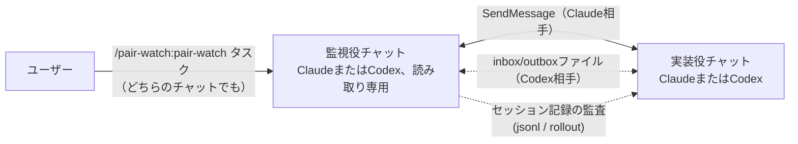
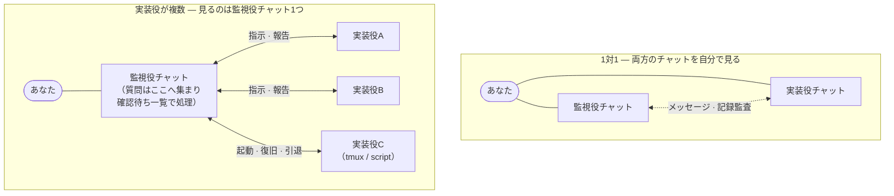

# pair-watch

> 内容は英語版（[README.md](README.md)）と対応しています。表現が食い違う場合は英語版を正とします。

コーディングエージェントを、監督付きのペアで動かすためのClaude Codeプラグインです。**実装役**がコードを書き、**読み取り専用の監視役**が、その報告をgit・テスト・実装役自身のセッション記録と突き合わせて検証します。どちらも普通のチャットなので、いつでも人間が割り込めます。Claude同士、Claude + Codex、Codex + Codexで動き、実装役は1人から複数まで増やせます。始めるのは片方のチャットでコマンドを1つ打つだけです。



## 何をするものか

チャットを2つ開き、**片方だけ**に `/pair-watch:pair-watch <タスク1行>` と打ちます。打たれた側が（「指示を待て」とだけ言われた場合を除き）自分の役割を判定し、相手のセッションを見つけて、役割ごとの指示書を届けます。そこからは監督付きの作業ループです。実装役がコードを変更し、監視役は報告を要約して信じるのではなく実物で確かめ、コミットの前には独立レビューを取り仕切ります。あなたのソースコードを監視役が変更することはありません（後述の受け渡しファイルだけは書きます）。人間が決めるべきことは、エージェント同士で決めずに人間へ戻します。

2つのチャットをつなぐ通信手段は、相手の種類で自動的に切り替わります。

- **相手がClaudeチャット** — Claude Codeのセッション間メッセージ機能（SendMessage／ListAgents）を使います。届いたら起こしてもらう受信駆動なので見張り続ける必要がなく、待機中のトークン消費はわずかです。
- **相手がCodex CLIチャット** — Codexはこのメッセージ機能に参加できないため、連番付きの2つのファイル（監視役が指示を書く `pair-inbox.md`、実装役が報告を書く `pair-outbox.md`）と、Codexの会話記録（rolloutファイル）の監査に切り替えます。Codexの実装役はinboxを待つあいだターンを終えません。Codex + Codexでは監視役も同様にoutboxを待ちます。メッセージ末尾の完了連番により、待機前に届いた返信の見落としも、書きかけの読み込みも起きません。設計の経緯は [design-inbox-watch](plugins/pair-watch/skills/pair-watch/references/design-inbox-watch.md)（英語）にあります。

Codexを監視役にできるのは、実装役もCodexで、起動時にそれを明示した場合だけです。明示しなければ従来どおりClaude相手の動作です。

## インストール

```text
/plugin marketplace add inakaegg/pair-watch
/plugin install pair-watch@pair-watch
```

そのあと同じプロジェクトでチャットを2つ開き、片方でこう打ちます。

```text
/pair-watch:pair-watch <タスク1行>
```

相手のチャットは空のままで構いません。両側へ指示を書き続ける必要もありません。

### Claude監視役 + Codex実装役

1. 別のターミナルで、同じリポジトリでCodex CLIを起動します（Codexは別途インストールが必要です）。
2. Claude側のチャットで `/pair-watch:pair-watch <タスク1行> — peer: Codex CLI` と打ちます。相手がCodexだと伝えることでClaude側が監視役になります。伝えないと、ClaudeはClaudeの相手を探して待ち続けます。
3. 初回だけ、監視役が「この1行をCodexチャットへ貼ってください」と案内します（"Read `<inboxのパス>` and follow it."）。以後はCodexの実装役が自分でinboxを見張ります。

### Codex + Codex

1. 同じリポジトリでCodex CLIチャットを2つ起動します。
2. 読み取り専用の監視役にしたいチャットで `/pair-watch:pair-watch <タスク1行> — peer: Codex CLI` と打ちます。
3. 監視役が、実装役のチャットへ貼る1行を案内します。貼るのは最初の1回だけです。以後は実装役がinboxを、監視役がoutboxを待ちます。

約30分の待機上限に達すると、どちらの役を促せばよいかをpair-watchが伝えます。実装役には「check the inbox」、監視役には「check the outbox」と入力してください。

## 実装役を増やす

1人の監視役の下に、実装役を複数並べられます。各実装役の担当範囲は、ブランチもworktreeもファイルも重ならないように分割します。実装役のセッションは、あなたが自分で開いても、その回ごとの承認を得て監視役に起動させてもかまいません（tmuxまたはOS標準の `script(1)` の擬似端末の下で起動し、終わったら引退させます）。

あなたにとって変わるのは、見る場所です。見るのは監視役のチャット1つだけになります。各実装役からの質問と報告はそこへ集まり、あなたの判断が要る項目は1件ずつ割り込む代わりに、確認待ちの一覧（pending list）にまとまります。起動直後の生存確認、応答が止まったセッションの検知と復旧、作業後の片付けも監視役が受け持ちます（セッションの引退には、コミットされていない作業が残っている可能性があるため、あなたの指示が必要です）。



実装役の人数に決まった上限はありません。レビュー役は別プロセスとして並列に走るので、レビューの量が上限を決めるわけではありません。効いてくるのは仕事の形のほうです。席どうしはファイルとbranchが重ならないことが前提なので、いま独立して着手できるタスクの数がそのまま上限になります。これに、あなたに溜まる確認待ちと、監視役自身の文脈の膨らみが加わります。タスクが独立したぶんだけ席を足してください。運用の詳細はスキルの「Multiple implementer seats」節にあります。

**監視役に起動させる場合の権限設定。** 既定（auto）の権限モードで動く監視役は、許可ルールなしではセッションの起動をブロックされるのが普通です。先にtmuxの各コマンド（`tmux new-session` / `send-keys` / `capture-pane` / `kill-session` / `ls`）を `permissions.allow` へ追加しておきます。追加する前に、何を許すことになるかを知っておいてください。この許可があると、適用範囲内のセッションは `tmux new-session` 経由の任意コマンド起動・キー入力の注入・画面内容の読み取りを無確認で行えるようになります。この許可の効力はpair-watchの用途に限定されません。グローバルの `~/.claude/settings.json` よりプロジェクト側の `.claude/settings.json` を優先し、起動運用をやめたら削除してください。監視役も、ルールの追加を頼む前に同じ注意を説明します。また、起動されるセッションは `--dangerously-skip-permissions` で動くため、起動そのものが毎回のオプトインです。

## 既にある多エージェント機能と、何が違うのか

Claude Codeにはエージェントを複数動かす仕組みが既にいくつもあり、Codexにも独自のものがあります。それらとpair-watchを分ける問いは2つです。**作業中のエージェントに人間が話しかけられるか**。そして、**その成果を誰が検証するか**。

既存の仕組みの多くは、話しかけられない作業役を使います。サブエージェント（ClaudeのものもCodexのものも）とスクリプト統括のworkflowsは、起動したセッションの内部で動きます。途中で割り込めず、親が終われば一緒に消えます。設定の自由度は両者で違い、素のサブエージェントはモデルも思考の深さも親のものを引き継ぎますが、スクリプト統括のworkflowsはエージェントごとに指定できます。割り込めないこと以上に効いてくるのが、成果の行き先です。作業役の結果は自分を操縦した統括役へ戻り、統括役はそれを**要約して自分の文脈へ取り込みます**。検証ではなく信用です。自分の立てた計画を自分で採点する構造でもあります。使い捨ての調査ならそれで十分ですが、mergeするつもりの変更の品質保証には向きません。

素のセッション間メッセージ機能を使えば、どちらも普通のチャットなので、割り込めない問題は消えます。ただしこれは通信路にすぎません。セッションを2つつないだだけでは、片方が報告し、もう片方がそれを信じるという同じ構図を、手動でなぞることになります。役割も、検証の義務も、コミット前に何をするかも、何も決まっていません。

いちばん近いのはAgent teamsです。チームメイトは完全なセッションで、人間からも話しかけられます。残る違いは、検証の向きです。リードが計画を承認し、報告を受け取って進みますが、チームメイトのセッション記録を読み返して裏を取る役はいません。

pair-watchは、素のメッセージングという通信路の上に、足りなかった取り決めを載せたものです。

- **役割の非対称性。** 監視役はあなたのソースコードを書きません。書かないからこそ検証者でいられます。差分に対する利害がなく、自分で書いたことによる思い込みも持ちません。
- **検証の義務。** 監視役は報告を、まず実物で確かめます。読み取り専用のgit操作・grep・テストの再実行です。相手のセッション記録を読むのは、実物からは検証できない主張（「ユーザーが承認した」「この判断はユーザー指示だった」）の由来を確認するときです。なお記録を読むこの監査役は、レビュー関門の担当とは別の役です。レビュー担当には実装者の会話を渡さず、まっさらな文脈で判定させます。
- **開始の自動化。** コマンド1つで役割の判定・相手の発見・指示書の配達まで進みます。
- **判断の集約。** 人間の判断が要ることは、実装役が何人いても監視役のチャット1つに集まります。
- **Claude以外も参加できる。** Codexはメッセージ機能に参加できませんが、連番付きファイルの受け渡しで同じ役割と義務のもとに入ります。
- **実装役の増員に対応。** 範囲の分割、承認を得たセッションの起動、停止の検知と復旧、後片付けまで扱います（前の「実装役を増やす」の節）。

表で並べると次のとおりです。

| | 動き方 | 誰が操縦するか | ベンダー横断 | 独立した検証 |
|---|---|---|---|---|
| [サブエージェント](https://code.claude.com/docs/en/sub-agents) | 1つのセッション内で動く補助役。結果は呼び出し元へ戻る | そのセッションのClaude | なし | なし。呼び出し元が結果を要約して自分の文脈へ取り込む |
| [Agent teams](https://code.claude.com/docs/en/agent-teams)（実験的、環境変数で有効化） | リードのセッションがチームメイトを起動する。各チームメイトは完全なセッション | リード。人間もチームメイトへ直接話せる | なし | リードが計画を承認する。会話記録の監査はしない |
| [セッション間メッセージ機能](https://code.claude.com/docs/en/cross-session-messaging) | 人間が開いた独立セッション同士がテキストを交換する | 人間がセッションごとに | なし | なし。これは通信路 |
| [Dynamic workflows](https://code.claude.com/docs/en/workflows) | スクリプトが多数のサブエージェントを裏で統括する | スクリプト | なし | 互いに反証させるレビューをスクリプト化できる |
| [Codexのサブエージェント](https://developers.openai.com/codex/subagents) | 1つのCodexセッション内で並列に動くワーカー | Codexの統括役 | なし | なし |
| セッション管理ツール（tmux、ccmanager等） | 多数のセッションを並べて表示する | 人間 | 見た目上は可 | なし。セッション間の取り決めがない |
| **pair-watch** | **役割を固定した対話セッション** | **人間がどちらのチャットからでも。作業ループは監視役が回す** | **Claude同士、Claude + Codex、Codex + Codex** | **読み取り専用の監視役が、git・テスト・相手の会話記録で報告を検証する。コミット前に独立レビューがある** |

### 設計上の特徴

- **固定された非対称な役割。** 実装役1人と読み取り専用の監視役1人。文脈を共有せずに一方が他方を検証できる、いちばん小さな構成です。同じ取り決めのまま、1人の監視役の下で実装役を複数に増やせます（前の「実装役を増やす」の節）。
- **同梱の手順は最低限だけ。** このスキルが手順を持つのは、監視役が検証の基準を持てるようにするためです。中身はタスクの契約書、コミット前に独立レビューで `VERDICT: LGTM`（問題なし）を得ること、コミットしてよい条件の3つだけ。プロジェクト側に独自の規則があればそちらが優先され、pair-watchはセッション運用だけを受け持ちます。この置き換えはagent-kit専用の連携ではなく、両CLIが起動時に読むそのリポジトリの `AGENTS.md` に契約・レビュー規則が書いてあれば同じ仕組みで効きます（実地で検証済みの組み合わせは、作者の [agent-kit](https://github.com/inakaegg/agent-kit) です。契約と3段階レビューの完全版がこの最低限を置き換えます）。
- **常駐するものがない。** コマンド1つで始まり、環境変数もdaemonも要りません。Claude相手は受信駆動、Codex相手はスキル付属の上限付きshell待機です。

### 使う前に知っておくこと

- **コスト。** 動いているセッションはどれも完全なセッションで、レビューのたびにレビュー担当のプロセスが1つ加わります。
- **取り決めの大部分はエージェントへの指示。** 役割、停止条件、どちらがファイルを書くか、`VERDICT` の規律は、モデルがスキルに従うことで成立します。待機スクリプトと静的検査が機械的に保証するのは、メッセージの完了判定と文書の中核条件だけです。
- **Codex側のセッションには、長時間コマンドを許す環境が要ります。** ファイル待機はshellのsleepループを保持します。コマンドごとに承認が要る環境では、そのセッションだけ人間が促す手動運用になります。

向いているのは、報告を実物で確かめる第二の目が欲しい非自明な変更、監督付きでCodexに実装させたい場面、そして1つのチャットから監督したい並行作業です。同梱の取り決めのぶんだけ、ちょっとした修正には過剰です。

## 何を読み、何を書くか

監査こそ監視役の存在理由なので、何に触れるかを明示します。

- 監視役は相手セッションのローカルの記録を読むことがあります。対象はClaude Codeのセッションファイル（`~/.claude/projects/<slug>/<id>.jsonl`）とCodexのrolloutファイル（`~/.codex/sessions/YYYY/MM/DD/rollout-*.jsonl`）です。開始宣言の裏取り、「ユーザーが承認した」という報告の確認、報告と実物の突き合わせに使います。
- 相手を見つける段階では、起動された側が役割を問わず、メッセージを送る前に同じプロジェクトの新しいセッション記録を最大2件読み、直近のユーザー発言から相手を見分けることがあります。候補へ伝えるのはファイルのパスだけで、記録の本文は引用しません。
- 2つのセッションのどちらかが、リポジトリ内に受け渡し用のファイルを書きます。タスクの契約書（`_ai/tasks/<slug>/TASK.md`）と、Codex相手の場合は同じ `_ai/tasks/<slug>/`（メインのcheckout側）の `pair-inbox.md` / `pair-outbox.md` です。`_ai/` はバージョン管理の対象外にしてください（`.gitignore` へ追加）。
- コードを変更する作業では、タスク専用のブランチと別のgit worktreeを作ります。通常は実装役が作り、Codexのsandboxが `.git` へ書けないときは監視役が代わりに作ります。`main` のcheckout上では作業しません。
- すべてあなたのマシン内で完結します。このスキルが外部へ何かを送ることはありません。

## 動作確認済みの環境

- Claude Code 2.1.224以降（セッション間メッセージ機能 SendMessage／ListAgents／Monitor）
- Codex CLI 0.147系。どちらかの役がCodexの場合に必要（rolloutファイルの配置 `~/.codex/sessions/YYYY/MM/DD/`）

記録の監査は、両CLIがローカルに保存しているセッションファイルを読みます（パスは「何を読み、何を書くか」を参照）。

## うまく動かないとき

よくある症状と、その意味です。

- *相手が見つからない。確認の問いに15分たっても返事がない* — 相手のチャットが起動していないか、メッセージ機能の挙動が変わっています。スキルは観測した事実を報告して、指示を待ちます。
- *送ったメッセージや返信が、いつまでも相手に届かない* — 受信側で、配送前の承認待ちになっています。Claude Codeはセッション間のメッセージを既定で受信側ユーザーの承認にかけます（`--dangerously-skip-permissions` で起動していても出ます）。しかも一度の承認は次のメッセージへ引き継がれません。両側の `~/.claude/settings.json` に `"crossSessionInbound": "accept"` を設定するか、`/config` の「Messages from your other sessions」をacceptにしてください。
- *監視役が、Codexチャットへの最初の貼り付けを待っている* — 初回だけ、1行の貼り付けを案内して最長15分待ちます。貼れば再開します。
- *Codexの実装役がinboxに反応しない* — ファイル待機が終わった（30分上限）か、コマンドごとに承認が要る環境で待機が動いていません。Codexチャットへ「check the inbox」と一言打ってください。この手動運用への切り替えは設計どおりの動きです。
- *Codexの監視役がoutboxに反応しない* — 同じく待機切れか、待機コマンドが承認を求められて止まっています。監視役のチャットへ「check the outbox」と入力してください。
- *監査の手順がセッションファイルを見つけられない* — CLIの更新で置き場所が変わっています。Issueで教えてください。それまでも、記録の監査抜きで体制そのものは動きます。
- *`/pair-watch` を打っても「Use the Skill tool to invoke…」が繰り返されるだけでスキルが始まらない* — インストールされているのが0.2.0で、コマンドの雛形が同名スキルを覆い隠す不具合がありました。0.3.0で雛形を撤去し、起動は完全名 `/pair-watch:pair-watch` になっています。`claude plugin marketplace update <マーケットプレイス名> && claude plugin update pair-watch@<マーケットプレイス名>` で更新し、新しいセッションで使ってください。
- *セッション開始時に「インストール済みの版が古い」という通知が出る* — 同梱の版チェックが、インストール済みの複製とマーケットプレイス実体のずれを見つけたものです。提案された更新コマンドを実行するか、無視してそのまま使えます（動作は止まりません）。

停止条件の一覧は `SKILL.md` にあります。推測で進むより、止まって聞く側に倒した作りです。

## 出自と保守

作者の作業キット（[agent-kit](https://github.com/inakaegg/agent-kit)、日本語）の中の日本語スキルとして生まれ、その英語版としてこのプラグインが切り出されました。しばらく両方が並存しましたが、同じ手順を2か所で保守する二重管理になるため、2026年8月にこのプラグインへ一本化され、kit側の同梱スキルは廃止されました。いまはこのプラグインがこの仕組みの唯一の正本です。CLIの更新で動かなくなったときは、症状を添えたIssueを歓迎します。

想定している使い方は、agent-kitのように契約とレビューを定めた `AGENTS.md` を持つリポジトリとの併用です。その場合、リポジトリ側の規則がスキル同梱の最低限の手順を置き換え、pair-watchはセッション運用に徹します。

日本語で使う場合も、このプラグインはそのまま動きます（出力の言語はタスク記述の言語に追従します）。

## ライセンス

MIT
