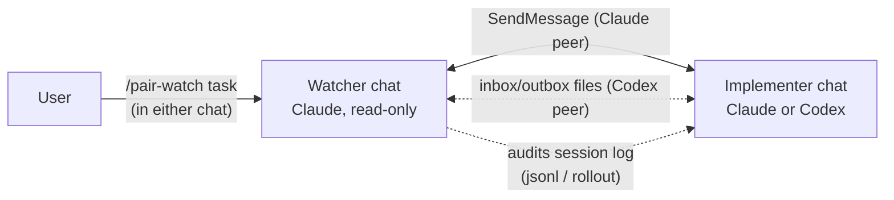

# pair-watch

> 本文書は英語版（[README.md](README.md)）からの翻訳です。差異がある場合は英語版を正とします。

コーディングエージェントを2つのチャットで組ませるペアプログラミングです。片方が**実装役**、もう片方が**読み取り専用の監視役**で、監視役は相手のセッションの記録まで読んで報告を検証します。実装役はClaudeでもCodex CLIでも構いません（ベンダー横断）。起動は片側のチャットでコマンドを1つ打つだけです。



## 何をするものか

チャットを2つ開き、**片方だけ**に `/pair-watch <タスク1行>` と打ちます。打たれた側が自分の役割を判定し、相手のセッションを見つけ、役割ごとの指示書（brief）を届けて、監督付きの作業ループが始まります。実装役はコードを変更します。監視役はあなたのソースコードを変更しません（後述の受け渡しファイルは書きます）。実装役の報告を実物——読み取り専用のgit操作、grep、テストログ——で確かめ、コミット前の独立レビューを取り仕切ります。人間が決めるべきことは人間へ戻します。

2つのチャットをつなぐ通信手段は、相手の種類で自動的に切り替わります。

- **相手がClaudeチャット** — Claude Codeのセッション間メッセージ機能（SendMessage／ListAgents）を使います。届いたら起こしてもらう受信駆動なので、見張り続ける必要がなく、待機中のトークン消費はわずかです。
- **相手がCodex CLIチャット** — Codexはこのメッセージ機能に参加できません。そこで受け渡し用のファイル2つ（監視役が指示を書く `pair-inbox.md`、実装役が報告を書く `pair-outbox.md`）と、Codexが保存する会話記録（rolloutファイル）の監査に切り替えます。Codex実装役は監視役の返事を待つあいだターンを終えず、sleepループでinboxの更新を見張ります（この待機をinbox-watchと呼びます）。指示が届いた瞬間に動き出すので、人間が毎回「inboxを確認して」と打つ必要はありません。

Codex側の待機の設計経緯は [design-inbox-watch](plugins/pair-watch/skills/pair-watch/references/design-inbox-watch.md)（英語）にあります。

Codexは実装役専用で、監視役は常にClaudeです。逆向きをあえて対応しない理由も設計ノートに書きました。

## 類似の仕組みとの違い

Claude Codeには複数のエージェントを動かす仕組みが既にいくつもあり、Codexにも独自のものがあります。pair-watchはそれらの置き換えではありません。「役割を固定した対話セッション2つ＋検証の手順」という特定の構成を、Claude Codeのセッション間メッセージ機能の上に組んだものです。

| | 動き方 | 誰が操縦するか | ベンダー横断 | 独立した検証 |
|---|---|---|---|---|
| [サブエージェント](https://code.claude.com/docs/en/sub-agents) | 1つのセッション内で動く補助役。結果は呼び出し元へ戻る | そのセッションのClaude | なし | なし。呼び出し元が結果を要約して自分の文脈へ取り込む |
| [Agent teams](https://code.claude.com/docs/en/agent-teams)（Claude Codeのチーム機能。実験的、環境変数で有効化） | リード（lead）のセッションがチームメイトを起動する。各チームメイトは完全なセッション | リード。人間もチームメイトへ直接話せる | なし | リードが計画を承認する。会話記録の監査はしない |
| [セッション間メッセージ機能](https://code.claude.com/docs/en/cross-session-messaging) | 人間が開いた独立セッション同士がテキストを交換する | 人間がセッションごとに | なし | なし。これは通信路 |
| [Dynamic workflows](https://code.claude.com/docs/en/workflows)（スクリプトによる大量統括） | スクリプトが多数のサブエージェントを裏で統括する | スクリプト | なし | 互いに反証させるレビューをスクリプト化できる |
| [Codexのサブエージェント](https://developers.openai.com/codex/subagents) | 1つのCodexセッション内で並列に動くワーカー | Codexの統括役 | なし | なし |
| セッション管理ツール（tmux、ccmanager等） | 多数のセッションを並べて表示する | 人間 | 見た目上は可 | なし。セッション間の取り決めがない |
| **pair-watch** | **人間が開いた対話セッション2つ。役割は固定** | **人間がどちらのチャットからでも。作業ループは監視役が回す** | **Claudeの監視役＋ClaudeまたはCodexの実装役** | **読み取り専用の監視役が、git・テスト・相手の会話記録で報告を検証する。コミット前に独立レビューの関門がある** |

### 設計上の特徴

- **役割を固定した2席。** 実装役が1つ、読み取り専用の監視役が1つ。チームではなく、並列展開もしません。並列作業はagent teamsやdynamic workflowsの領分です。2席は、文脈を共有せずに一方が他方を検証できる最小の構成です。
- **監視役は要約せず検証する。** 報告は読み取り専用のgit操作・grep・テストログと突き合わせます。重要な主張（例:「ユーザーが承認した」）は、相手のセッションの会話記録（transcript）そのものを読んで裏を取ります。サブエージェントやチームメイトは、自分を操縦している統括役へ報告を戻すだけです。
- **人間がループに残る。** 2席とも普通のチャットなので、いつでも話しかけられます。判断が要ることはエージェント同士で決めず、人間へ戻します。
- **ベンダー横断は一方向。** 監視役は常にClaude、実装役はClaudeチャットかCodex CLIチャットです。Codex実装役は受け渡しファイルとinbox-watchで動くので、毎回「inboxを確認して」と打つ必要がありません。逆向き（Codexの監視役）はあえて非対応で、理由は設計ノートにあります。
- **作業手順込み。** タスクの契約書、コミット前に独立レビューで合否判定の行（`VERDICT: LGTM`＝問題なし、または `VERDICT: CHANGES REQUESTED`＝要修正）を得る関門、コミットしてよい条件が、取り決めの一部です。レビュー担当は可能なら相手系統の新しいプロセスで、Claude実装役ならCodex、Codex実装役の場合やCodex未導入なら別のClaudeプロセスです。プロジェクト自身の `AGENTS.md` に同種の規則があればそちらが優先されます。
- **有効化の手間なし。** コマンド1つで始まり、環境変数も統括スクリプトも要りません。Claude Codeの公式機能であるセッション間メッセージ機能の上に載っています。Claude相手は受信駆動で、Codex実装役はトークン消費ゼロでinboxを待ちます。

### 使う前に知っておくこと

- **コスト。** 完全なセッション2つに加えて、関門ごとにレビュー担当のプロセスが1つ動きます。
- **取り決めはコードではなくプロンプト。** 役割、停止条件、合否判定の規律はモデルが従う指示です。機械的な強制はなく、取り決めの自動テストもありません。
- **Codex実装役には長時間コマンドを許す環境が要る。** inbox-watchはshellのsleepループを保持します。コマンドごとに承認が要る環境では、人間が促す手動運用に切り替わります。

向いているのは、要約ではなく検証をする第二の目が欲しい非自明な変更と、監督付きでCodexに実装させたい場面です。作業手順込みなので小さな修正には過剰で、2席の設計は並列の大量作業には向きません。

## 何を読み、何を書くか

監査こそ監視役の存在理由なので、何に触れるかを明示します。

- 監視役は相手セッションのローカルの記録を読むことがあります。対象はClaude Codeのセッションファイル（`~/.claude/projects/<slug>/<id>.jsonl`）とCodexのrolloutファイル（`~/.codex/sessions/YYYY/MM/DD/rollout-*.jsonl`）です。開始宣言の裏取り、「ユーザーが承認した」という報告の確認、報告と実物の突き合わせに使います。
- リポジトリ内に受け渡し用のファイルを書きます。タスクの契約書（`_ai/tasks/<slug>/TASK.md`）と、Codex相手の場合は同じディレクトリ（メインのcheckout側）の `pair-inbox.md` / `pair-outbox.md` です。`_ai/` はバージョン管理の対象外にしてください（`.gitignore` へ追加）。
- コードを変更する作業では、実装役がタスク専用のブランチと別のgit worktreeを作ります。`main` のcheckout上では作業しません。
- すべてあなたのマシン内で完結します。このスキルが外部へ何かを送ることはありません。

## インストール

```text
/plugin marketplace add inakaegg/pair-watch
/plugin install pair-watch@pair-watch
```

そのあと同じプロジェクトでチャットを2つ開き、片方でこう打ちます。

```text
/pair-watch <タスク1行>
```

相手のチャットは空のままで構いません。両側へ指示を書き続ける必要もありません。

### Codex CLIチャットと組む場合

1. 別のターミナルで、同じリポジトリでCodex CLIを起動します（Codexは別途インストールが必要です）。
2. Claude側のチャットで `/pair-watch <タスク1行>` と打ちます。Claude側が監視役になります。
3. 初回だけ、監視役が「この1行をCodexチャットへ貼ってください」と案内します（"Read `<inboxのパス>` and follow it."）。以後はCodex実装役が自分でinboxを見張ります。

## 動作確認済みの環境

- Claude Code 2.1.224以降（セッション間メッセージ機能 SendMessage／ListAgents／Monitor）
- Codex CLI 0.147系（rolloutファイルの配置 `~/.codex/sessions/YYYY/MM/DD/`）

記録の監査は、両CLIがローカルに保存しているセッションファイルを読みます（パスは「何を読み、何を書くか」を参照）。

## 壊れたときの見分け方

よくある症状と、その意味です。

- *相手が見つからない、または15分以内に確認の返事がない* — 相手のチャットが起動していないか、メッセージ機能の挙動が変わっています。スキルは観測した事実を報告して指示を待ちます。
- *Codex相手がinboxに反応しない* — inbox-watchが終わっているか（30分上限）、コマンドごとに承認が要る環境で待機が動けていません。Codexチャットへ「check the inbox」と一言打ってください。この手動運用への切り替えは設計どおりの動きです。
- *監査の手順がセッションファイルを見つけられない* — CLIの更新で置き場所が変わっています。Issueで教えてください。それまでも、記録の監査抜きで体制そのものは動きます。

停止条件の一覧は `SKILL.md` にあります。推測で進むより、止まって聞く側に倒した作りです。

## 出自と保守

作者の作業キット（[agent-kit](https://github.com/inakaegg/agent-kit)、日本語）にあるpair skillの英語版を、単体でインストールできる形に切り出したものです。日本語の原型はagent-kit側で進化を続け、この英語版は**ベストエフォート**で追随します。CLIの更新で動かなくなったときは、症状を添えたIssueを歓迎します。

日本語で使う場合もこのプラグインはそのまま動きます（出力言語はタスク記述の言語に追従します）。agent-kitを導入済みなら、同じ仕組みの日本語版スキル `pair` がそちらに入っているので、どちらを使っても構いません。

## ライセンス

MIT — [LICENSE](LICENSE) を参照。
