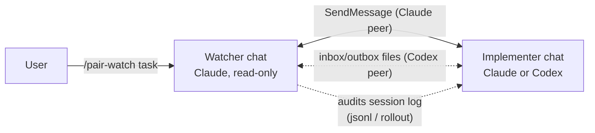

# pair-watch

> 本文書は英語版（[README.md](README.md)）からの翻訳です。差異がある場合は英語版を正とします。

コーディングエージェント2セッションによるペアプログラミング。**実装役**と**読み取り専用の監視役**を別々のチャットに置き、セッションログの監査つきで回します。起動は片側から1コマンドだけ。



## 何をするものか

チャットを2つ開き、**片方だけ**に `/pair-watch <タスク1行>` と打ちます。打たれた側が自分の役割を判定し、相手セッションを見つけ、役割briefを届けて監督付きのループが始まります。実装役はコードを変更します。監視役は報告を実物（read-onlyのgit・grep・テストログ）で検証し、独立レビューのgateを取り仕切り、コードには触れません。人間が決めるべきことは人間へ戻します。

transportは相手の種類で自動的に切り替わります。

- **相手がClaudeチャット** — SendMessage/ListAgentsによる受信駆動のメッセージング。ポーリングは無く、トークン消費は小さい。
- **相手がCodex CLIチャット** — Codexはセッション間メッセージングに参加できないため、合意ファイル（`pair-inbox.md` / `pair-outbox.md`）とrollout監査に切り替わります。Codex実装役は監視役の返事を待つあいだターンを終えず、sleepループでinboxを見張り（**inbox-watch**）、指示が届いた瞬間に動き出します。設計の経緯は [design-inbox-watch](plugins/pair-watch/skills/pair-watch/references/design-inbox-watch.md)（英語）にあります。

Codexは実装役専用で、監視役は常にClaudeです。逆向きをあえて対応しない理由も設計ノートに書きました。

## プライバシー: 相手セッションのログを読みます

監査こそ監視役の存在理由なので、何に触れるかを明示します。

- 監視役は相手セッションのローカル記録を読むことがあります。対象はClaude Codeのセッションファイル（`~/.claude/projects/<slug>/<id>.jsonl`）とCodexのrollout（`~/.codex/sessions/YYYY/MM/DD/rollout-*.jsonl`）です。開始宣言の裏取り、「ユーザーが承認した」という報告の確認、報告と実物の突き合わせに使います。
- すべてあなたのマシン内で完結します。このスキルが外部へ何かを送ることはありません。

## インストール

```text
/plugin marketplace add inakaegg/pair-watch
/plugin install pair-watch@pair-watch
```

そのあと同じプロジェクトでチャットを2つ開き、片方でこう打ちます。

```text
/pair-watch <タスク1行>
```

相手チャットは空のままで構いません。両側へ指示を書き続ける必要もありません。

## 動作確認済みの環境

- Claude Code 2.1系（SendMessage / ListAgents / Monitor が必要）
- Codex CLI 0.147系（rollout配置 `~/.codex/sessions/YYYY/MM/DD/`）

これらは**安定インターフェースではありません**。セッションファイルの場所もメッセージ機能もrollout配置も、どちらのCLIの更新でも変わり得ます。

## 壊れたときの見分け方

- *相手が見つからない、または15分以内に確認の返事がない* — 相手チャットが起動していないか、ListAgents/SendMessageの挙動が変わっています。スキルは観測事実を報告して指示を待ちます。
- *Codex相手がinboxに反応しない* — inbox-watchが終わっているか（30分上限）、コマンドごとに承認が要る環境でwatchが動けていません。Codexチャットへ「check the inbox」と一言打ってください。この手動fallbackは設計どおりの動きです。
- *監査ステップがセッションファイルを見つけられない* — CLIの更新で置き場所が変わっています。Issueで教えてください。それまでも、ログ監査抜きで体制自体は動きます。

停止条件の一覧は `SKILL.md` にあります。推測で進むより、止まって聞く側に倒した作りです。

## 出自と保守

作者の作業キット（[agent-kit](https://github.com/inakaegg/agent-kit)、日本語）にあるpair skillの英語版を、単体でインストールできる形に切り出したものです。日本語の原型はagent-kit側で進化を続け、この英語版は**ベストエフォート**で追随します。CLIの更新で動かなくなったときは、症状を添えたIssueを歓迎します。

日本語で使う場合もこのプラグインはそのまま動きます（出力言語はタスク記述の言語に追従します）。agent-kitを導入済みなら、そちらの `pair` を使う手もあります。

## ライセンス

MIT — [LICENSE](LICENSE) を参照。
