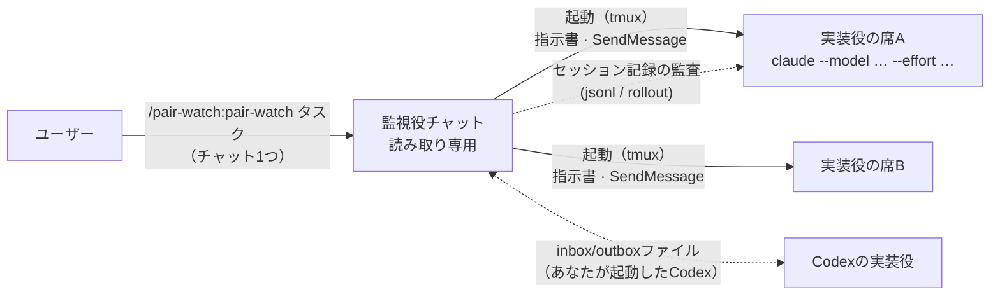
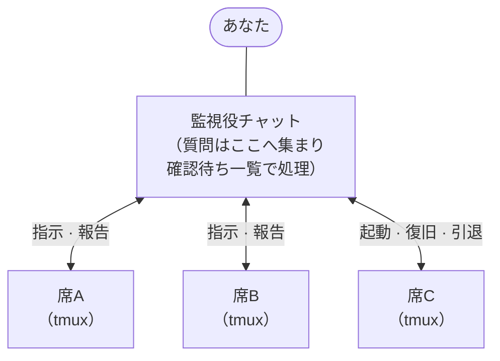

# pair-watch

> 内容は英語版（[README.md](README.md)）と対応しています。表現が食い違う場合は英語版を正とします。

コーディング作業を、チャット1つから監督付きのペアで動かすためのClaude Codeプラグインです。コマンドを打ったチャットが**読み取り専用の監視役**になり、**実装役**のセッションを自分で起動します。監視役は実装役の報告を、git・テスト・実装役自身のセッション記録と突き合わせて検証し、コミットの前に独立レビューを取り仕切ります。監視役と各実装役はそれぞれ1つの席（普通の対話セッション）を占め、どの席にもいつでも人間が話しかけられます。Claudeの席（監視役が起動）とCodexの席（Claude + Codex、Codex + Codex）で動き、実装役は1人から複数まで増やせます。



## 何をするものか

チャットを1つ開き、`/pair-watch:pair-watch <タスク1行>` と打ちます。そのチャットが監視役です。監視役はタスクの契約書（目的・範囲・合格条件を書いた `_ai/tasks/<slug>/TASK.md`）を書くか読み、仕事に要る実装役の席の数を決め（独立した部分に分かれない限り1つ）、席ごとに本物のCLIセッションをtmuxの下で起動して、役割の指示書を渡します。モデルと思考の深さは席ごとに指定できます。そこからは監督付きの作業ループです。実装役がコードを変更し、監視役は報告を要約して信じるのではなく実物で確かめ、コミットの前には独立レビューを取り仕切ります。あなたのソースコードを監視役が変更することはありません（後述の受け渡しファイルだけは書きます）。人間が決めるべきことは、監視役のチャットに確認待ちの一覧としてまとまって戻ってきます。席のタスクが終わると、監視役がその席を引退させます。

席の種類は2つで、起動時の指定で決まります。

- **Claudeの席**（既定） — 監視役が `claude --model … --effort … --dangerously-skip-permissions` をtmuxの下で起動します。通信はClaude Codeのセッション間メッセージ機能（SendMessage）です。この画面を見る人間はいないので、判断が要ることはすべて監視役へ送られます。
- **Codexの席**（`— peer: Codex CLI`） — Codexチャットはあなたが自分で起動します。Codexはメッセージ機能に参加できないため、連番付きの2つのファイル（監視役が指示を書く `pair-inbox.md`、実装役が報告を書く `pair-outbox.md`）と、Codexの会話記録（rolloutファイル）の監査に切り替えます。Codexの実装役はinboxを待つあいだターンを終えません。Codex + Codexでは監視役も同様にoutboxを待ちます。設計の経緯は [design-inbox-watch](plugins/pair-watch/skills/pair-watch/references/design-inbox-watch.md)（英語）にあります。

自分で開いたチャットを実装役にしたいときは、`— seat: <セッション一覧の名前>` で名前を指定します。監視役は起動する代わりに、そのセッションへ指示書を送ります。指定がないのに監視役が相手を探し回ることはありません。

## インストール

```text
/plugin marketplace add inakaegg/pair-watch
/plugin install pair-watch@pair-watch
```

### 初回の前に

起動される席は `--dangerously-skip-permissions` で動き、監視役はそれをtmux経由で起動します。tmuxが入っている必要があります（macOSで確認）。次の3つが揃っていないと起動は静かに失敗します。監視役が確認して、足りないものを伝えます。

1. **tmuxのコマンドを許可する。** `permissions.allow` に次を追加します。許可の範囲をそのリポジトリに限るため、プロジェクトの `.claude/settings.json` が望ましいです。

   ```json
   "Bash(tmux new-session:*)", "Bash(tmux send-keys:*)", "Bash(tmux capture-pane:*)",
   "Bash(tmux kill-session:*)", "Bash(tmux ls:*)"
   ```

   何を許すことになるかを知っておいてください。この許可があると、適用範囲内のセッションは `tmux new-session` 経由の任意コマンド起動・キー入力の注入・画面内容の読み取りを無確認で行えます。効力はpair-watchの用途に限定されません。起動運用をやめたら削除してください。監視役はこの設定を代わりに書けません（自分の権限設定を書き換える操作は設計上ブロックされます）。チャットで承認しても権限の判定は変わりません。
2. **他のセッションからのメッセージを受け入れる。** `~/.claude/settings.json` に `"crossSessionInbound": "accept"` を設定します（`/config` の「Messages from your other sessions」でも可）。これがないと、席からの返信があなたの承認待ちで止まり、体制全体が黙り込みます。
3. **信頼済みのプロジェクトディレクトリで動かす。** 信頼していないディレクトリで起動した席は、作業領域の信頼確認ダイアログで止まります。git worktreeでの作業は、信頼済みのメインcheckoutから起動し、worktreeを `--add-dir` で追加します。

そのあと、チャット1つでこう打ちます。

```text
/pair-watch:pair-watch <タスク1行>
```

同じ行に付けられる指定: `— implementer: opus(xhigh)` で席のモデルと思考の深さ（これが既定値）、`— seat: <名前>` で自分が開いたチャットを使う、`— peer: Codex CLI` でCodexの実装役。

### Claude監視役 + Codex実装役

1. 別のターミナルで、同じリポジトリでCodex CLIを起動します（Codexは別途インストールが必要です）。
2. Claude側のチャットで `/pair-watch:pair-watch <タスク1行> — peer: Codex CLI` と打ちます。
3. 初回だけ、監視役が「この1行をCodexチャットへ貼ってください」と案内します（"Read `<inboxのパス>` and follow it."）。以後はCodexの実装役が自分でinboxを見張ります。

Codexの席を監視役から起動する方法は検証していないため、Codexチャットだけは引き続きあなたが起動します。

### Codex + Codex

1. 同じリポジトリでCodex CLIチャットを2つ起動します。
2. 読み取り専用の監視役にしたいチャットで `/pair-watch:pair-watch <タスク1行> — peer: Codex CLI` と打ちます。
3. 監視役が、実装役のチャットへ貼る1行を案内します。貼るのは最初の1回だけです。以後は実装役がinboxを、監視役がoutboxを待ちます。

約30分の待機上限に達すると、どちらの役を促せばよいかをpair-watchが伝えます。実装役には「check the inbox」、監視役には「check the outbox」と入力してください。

## 実装役を増やす

1人の監視役の下に、席を複数並べられます。各席の担当範囲は、ブランチもworktreeもファイルも重ならないように分割します。監視役が仕事を分割し、部分ごとに席を1つ起動して、その部分が終わった席は引退させます。席は1つのタスクにだけ使い、次のタスクを同じ席に渡すことはしません。席の文脈には前のタスクの履歴が残っていて、それを圧縮できるのはあなただけだからです。

あなたにとって変わるのは、見る場所です。見るのは監視役のチャット1つだけになります。各席からの質問と報告はそこへ集まり、あなたの判断が要る項目は1件ずつ割り込む代わりに、確認待ちの一覧（pending list）にまとまります。起動直後の生存確認、応答が止まった席の検知と復旧、作業後の片付けも監視役が受け持ちます。



席の数に決まった上限はありません。レビュー役は別プロセスとして並列に走るので、レビューの量が上限を決めるわけではありません。効いてくるのは仕事の形のほうです。席どうしはファイルとブランチが重ならないことが前提なので、いま独立して着手できるタスクの数がそのまま上限になります。さらに、人数とともに増える2つの負担があります。あなたに溜まる確認待ちと、監視役自身の文脈の膨らみです。運用の詳細はスキルの「Seats」節と [seat-launch](plugins/pair-watch/skills/pair-watch/references/seat-launch.md)（英語）にあります。

## 既にある多エージェント機能と、何が違うのか

Claude Codeにはエージェントを複数動かす仕組みが既にいくつもあり、Codexにも独自のものがあります。それらとpair-watchを分ける問いは2つです。**作業中のエージェントに人間が話しかけられるか**。そして、**その成果を誰が検証するか**。

既存の仕組みの多くは、話しかけられない作業役を使います。サブエージェント（ClaudeのものもCodexのものも）とスクリプト統括のworkflowsは、起動したセッションの内部で動きます。途中で割り込めず、親が終われば一緒に消えます。設定の自由度は両者で違います。素のサブエージェントは思考の深さ（effort）を親から引き継ぎ、それを上げられません。スクリプト統括のworkflows（下の表のDynamic workflows）は、思考の深さもモデルもエージェントごとに指定できます。割り込めないこと以上に効いてくるのが、成果の行き先です。作業役の結果は自分を操縦した統括役へ戻り、統括役はそれを**要約して自分の文脈へ取り込みます**。検証ではなく信用です。自分の立てた計画を自分で採点する構造でもあります。スクリプトなら互いに検証させる手順も組めますが、その検証も同じ統括役の内側で完結します。使い捨ての調査ならそれで十分ですが、mergeするつもりの変更の品質保証には向きません。

素のセッション間メッセージ機能を使えば、どちらも普通のチャットなので、割り込めない問題は消えます。ただしこれは通信路にすぎません。セッションを2つつないだだけでは、片方が報告し、もう片方がそれを信じるという同じ構図を、手動でなぞることになります。役割も、検証の義務も、コミット前に何をするかも、何も決まっていません。

いちばん近いのはAgent teamsです。チームメイトは完全なセッションで、人間からも話しかけられます。残る違いは、検証の向きです。リードが計画を承認し、報告を受け取って進みますが、チームメイトのセッション記録を読み返して裏を取る役はいません。

pair-watchは、素のメッセージングという通信路の上に、足りなかった取り決めを載せたものです。

- **役割の非対称性。** 監視役はあなたのソースコードを書きません。書かないからこそ検証者でいられます。差分に対する利害がなく、自分で書いたことによる思い込みも持ちません。
- **検証の義務。** 監視役は報告を、まず実物で確かめます。読み取り専用のgit操作・grep・テストの再実行です。席のセッション記録を読むのは、実物からは検証できない主張（「ユーザーが承認した」「この判断はユーザー指示だった」）の由来を確認するときです。なお記録を読むこの監査役は、レビュー関門の担当とは別の役です。レビュー担当には実装者の会話を渡さず、まっさらな文脈で判定させます。
- **席を自分で開かなくてよい。** チャット1つでコマンド1つ。監視役が、タスクに見合ったモデルと思考の深さで席を起動し、終わったら引退させます。
- **判断の集約。** 人間の判断が要ることは、席が何人いても監視役のチャット1つに集まります。
- **Claude以外も参加できる。** Codexはメッセージ機能に参加できませんが、連番付きファイルの受け渡しで同じ役割と義務のもとに入ります。

表で並べると次のとおりです。

| | 動き方 | 誰が操縦するか | ベンダー横断 | 独立した検証 |
|---|---|---|---|---|
| [サブエージェント](https://code.claude.com/docs/en/sub-agents) | 1つのセッション内で動く補助役。結果は呼び出し元へ戻る | そのセッションのClaude | なし | なし。呼び出し元が結果を要約して自分の文脈へ取り込む |
| [Agent teams](https://code.claude.com/docs/en/agent-teams)（実験的、環境変数で有効化） | リードのセッションがチームメイトを起動する。各チームメイトは完全なセッション | リード。人間もチームメイトへ直接話せる | なし | リードが計画を承認する。会話記録の監査はしない |
| [セッション間メッセージ機能](https://code.claude.com/docs/en/cross-session-messaging) | 人間が開いた独立セッション同士がテキストを交換する | 人間がセッションごとに | なし | なし。これは通信路 |
| [Dynamic workflows](https://code.claude.com/docs/en/workflows) | スクリプトが多数のサブエージェントを裏で統括する | スクリプト | なし | 互いに反証させるレビューをスクリプト化できる |
| [Codexのサブエージェント](https://developers.openai.com/codex/subagents) | 1つのCodexセッション内で並列に動くワーカー | Codexの統括役 | なし | なし |
| セッション管理ツール（tmux、ccmanager等） | 多数のセッションを並べて表示する | 人間 | 見た目上は可 | なし。セッション間の取り決めがない |
| **pair-watch** | **役割を固定した対話セッション。監視役が起動する** | **人間が監視役チャットから。作業ループは監視役が回す** | **Claudeの席、Claude + Codex、Codex + Codex** | **読み取り専用の監視役が、git・テスト・席の会話記録で報告を検証する。コミット前に独立レビューがある** |

### 設計上の特徴

- **固定された非対称な役割。** 読み取り専用の監視役1人と、実装役1人以上。文脈を共有せずに一方が他方を検証できる、いちばん小さな構成です。
- **同梱の手順は最低限だけ。** このスキルが手順を持つのは、監視役が検証の基準を持てるようにするためです。中身はタスクの契約書、コミット前に独立レビューで `VERDICT: LGTM`（問題なし）を得ること、コミットしてよい条件の3つだけ。プロジェクト側に独自の規則があればそちらが優先され、pair-watchはセッション運用だけを受け持ちます。両CLIは起動時にそのリポジトリの `AGENTS.md` を読むので、契約とレビューの規則がそこに書いてあれば同じ仕組みで効きます（実地で検証済みの組み合わせは、作者の [agent-kit](https://github.com/inakaegg/agent-kit) です。契約と3段階レビューの完全版がこの最低限を置き換えます）。
- **常駐するものがない。** コマンド1つで始まり、環境変数もdaemonも要りません。Claudeの席は受信駆動、Codexの席はスキル付属の上限付きshell待機です。

### 使う前に知っておくこと

- **コスト。** 席はどれも完全なセッションで、レビューのたびにレビュー担当のプロセスが1つ加わります。
- **起動された席は権限の確認を省きます。** `--dangerously-skip-permissions` で動きます。pair-watchを起動することが、その同意にあたります。席の質問は監視役へ、監視役の質問はあなたへ届きます。
- **取り決めの大部分はエージェントへの指示。** 役割、停止条件、どちらがファイルを書くか、`VERDICT` の規律は、モデルがスキルに従うことで成立します。待機スクリプトと静的検査が機械的に保証するのは、メッセージの完了判定と文書の中核条件だけです。
- **Codexの席には、長時間コマンドを許す環境が要ります。** ファイル待機はshellのsleepループを保持します。コマンドごとに承認が要る環境では、その席だけ人間が促す手動運用になります。

向いているのは、報告を実物で確かめる第二の目が欲しい非自明な変更、監督付きでCodexに実装させたい場面、そして1つのチャットから監督したい並行作業です。同梱の取り決めのぶんだけ、ちょっとした修正には過剰です。

## 何を読み、何を書くか

監査こそ監視役の存在理由なので、何に触れるかを明示します。

- 監視役は席のローカルの記録を読むことがあります。対象はClaude Codeのセッションファイル（`~/.claude/projects/<slug>/<id>.jsonl`）とCodexのrolloutファイル（`~/.codex/sessions/YYYY/MM/DD/rollout-*.jsonl`）です。開始宣言の裏取り、「ユーザーが承認した」という報告の確認、報告と実物の突き合わせに使います。読むのは自分が起動した席と、あなたが名前で指定した席の記録だけで、他のセッションを走査することはありません。
- 監視役はリポジトリ内に受け渡し用のファイルを書きます。タスクの契約書（`_ai/tasks/<slug>/TASK.md`）と、Codexの席の場合は同じ `_ai/tasks/<slug>/`（メインのcheckout側）の `pair-inbox.md` / `pair-outbox.md` です。`_ai/` はバージョン管理の対象外にしてください（`.gitignore` へ追加）。
- 監視役はリポジトリの外にも小さな管理ファイルを書きます。`~/.local/state/pair-watch/seats/<watcher-id>/<run-id>/` の下に席ごとに1ファイルで、席のラベル、プロジェクトのディレクトリ、tmuxセッション名、モデル、セッションID、引退時刻を記録します。自分の席と別のrunの席を見分けるためのものです。runが終わった時点でまとめて消します。途中で止まったrunの残りは手で消してかまいません。
- 監視役は、上の3つの前提を確認するためにあなたのClaude Codeの設定を読みます。書き換えることはありません。
- コードを変更する作業は、タスク専用のブランチと別のgit worktreeで行います。席を起動する場合は、監視役が起動前に作って席に場所を伝えます。`— seat:` で指定したセッションは自分で作ります。Codexの実装役も自分で作りますが、sandboxが `.git` へ書けないときは監視役が代わりに作ります。`main` のcheckout上では作業しません。
- すべてあなたのマシン内で完結します。このスキルが外部へ何かを送ることはありません。

## 動作確認済みの環境

- Claude Code 2.1.224以降（セッション間メッセージ機能 SendMessage／ListAgents／Monitor。tmuxからの席の起動はmacOSで確認）
- Codex CLI 0.147系。どちらかの役がCodexの場合に必要（rolloutファイルの配置 `~/.codex/sessions/YYYY/MM/DD/`）

記録の監査は、両CLIがローカルに保存しているセッションファイルを読みます（パスは「何を読み、何を書くか」を参照）。

## うまく動かないとき

よくある症状と、その意味です。

- *監視役が、許可ルール・`crossSessionInbound`・信頼済みディレクトリのどれかが足りないと言う* — 「初回の前に」に従って追加し、監視役に伝えてください。揃うまで起動しません。
- *起動した席から開始宣言が来ない* — 監視役が席の画面を確認します。作業領域の信頼確認ダイアログなら `tmux send-keys` で閉じるか、ディレクトリの信頼をあなたに頼みます。返信が承認待ちで止まっているなら `crossSessionInbound` の設定です。画面に手掛かりがなければ、事実を報告して待ちます。
- *`— seat:` で指定した名前が見つからない* — そのチャットが開いていないか、名前が違います。セッション一覧の正確な名前を伝えるか、指定を外して監視役に起動させてください。
- *起動した席が自分の画面で質問して止まっている* — 指示書は席に画面上で質問しないよう命じていますが、起きた場合は監視役が `tmux send-keys` で選択肢を閉じるか、席を止めて `claude --resume` で再開します。どちらでも作業は失われません。
- *監視役が、Codexチャットへの最初の貼り付けを待っている* — 初回だけ、1行の貼り付けを案内して最長15分待ちます。貼れば再開します。
- *Codexの実装役がinboxに反応しない* — ファイル待機が終わった（30分上限）か、コマンドごとに承認が要る環境で待機が動いていません。Codexチャットへ「check the inbox」と一言打ってください。この手動運用への切り替えは設計どおりの動きです。
- *Codexの監視役がoutboxに反応しない* — 同じく待機切れか、待機コマンドが承認を求められて止まっています。監視役のチャットへ「check the outbox」と入力してください。
- *監査の手順がセッションファイルを見つけられない* — CLIの更新で置き場所が変わっています。Issueで教えてください。それまでも、記録の監査抜きで体制そのものは動きます。
- *以前のように、チャットを2つ開いて片方に「指示を待て」と打っている* — その流れは0.4.0で廃止しました。監視役は相手を探さず、席を起動するか、`— seat: <名前>` で指定されたチャットに指示書を送ります。
- *`/pair-watch` を打っても「Use the Skill tool to invoke…」が繰り返されるだけでスキルが始まらない* — インストールされているのが0.2.0で、コマンドの雛形が同名スキルを覆い隠す不具合がありました。0.3.0で雛形を撤去し、起動は完全名 `/pair-watch:pair-watch` になっています。`claude plugin marketplace update <マーケットプレイス名> && claude plugin update pair-watch@<マーケットプレイス名>` で更新し、新しいセッションで使ってください。
- *セッション開始時に「インストール済みの版が古い」という通知が出る* — 同梱の版チェックが、インストール済みの複製とマーケットプレイス実体のずれを見つけたものです。提案された更新コマンドを実行するか、無視してそのまま使えます（動作は止まりません）。

停止条件の一覧は `SKILL.md` にあります。推測で進むより、止まって聞く側に倒した作りです。

## 出自と保守

作者の作業キット（[agent-kit](https://github.com/inakaegg/agent-kit)、日本語）の中の日本語スキルとして生まれ、その英語版としてこのプラグインが切り出されました。しばらく両方が並存しましたが、同じ手順を2か所で保守する二重管理になるため、2026年8月にこのプラグインへ一本化され、kit側の同梱スキルは廃止されました。0.3.xまでは、ユーザーがチャットを2つ開き、コマンドを打った側が相手を探す流れでした。実運用では、監視役が席を自分で起動するほうが単純で確実だと分かったため、0.4.0でそれを既定にし、探索の手順を廃止しました。いまはこのプラグインがこの仕組みの唯一の正本です。CLIの更新で動かなくなったときは、症状を添えたIssueを歓迎します。

想定している使い方は、agent-kitのように契約とレビューを定めた `AGENTS.md` を持つリポジトリとの併用です。その場合、リポジトリ側の規則がスキル同梱の最低限の手順を置き換え、pair-watchはセッション運用に徹します。

日本語で使う場合も、このプラグインはそのまま動きます（出力の言語はタスク記述の言語に追従します）。

## ライセンス

MIT
