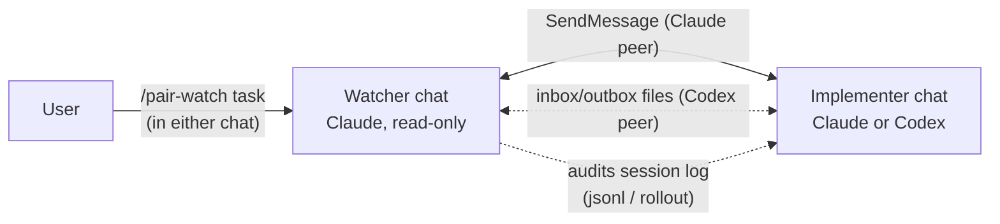

# pair-watch

🇯🇵 日本語: [README.ja.md](README.ja.md)

Cross-vendor pair programming for coding agents: an **implementer** plus a **read-only watcher**
across two chat sessions, with session-log auditing. Started from one side with a single command.



## What it does

You open two chats and type `/pair-watch <one-line task>` in **only one** of them. The invoked
side figures out its role, discovers the peer session, delivers the peer a role brief, and the two
run a supervised loop: the implementer changes code; the watcher verifies reports against the real
artifacts, coordinates independent review gates, and never edits your source (it does write the
coordination files described below). Decisions that belong to
the human are pushed back to the human.

Two transports, selected automatically:

- **Claude peer** — push-driven messaging (SendMessage/ListAgents). No polling, token-cheap.
- **Codex CLI peer** — Codex cannot join cross-session messaging, so coordination switches to
  two agreed files (the watcher writes instructions to `pair-inbox.md`, the implementer writes
  reports to `pair-outbox.md`) plus an audit of Codex's own session log (its rollout file). While waiting for the
  watcher, the Codex implementer holds its turn and watches the inbox with a sleep loop
  (**inbox-watch**), so it starts moving the moment an instruction lands. Design rationale:
  [design-inbox-watch](plugins/pair-watch/skills/pair-watch/references/design-inbox-watch.md).

Codex is implementer-only; the watcher is always a Claude chat. Why the reverse is deliberately
unsupported is covered in the design note.

## How it compares

Claude Code already ships several ways to run more than one agent, and Codex has its own. pair-watch does not replace them. It is one specific arrangement — two interactive seats with fixed roles and a verification protocol — built on top of Claude Code's cross-session messaging.

| | Runs as | Who steers | Cross-vendor | Independent verification |
|---|---|---|---|---|
| [Subagents](https://code.claude.com/docs/en/sub-agents) | Helpers inside one session; results return to the caller | Claude in that session | No | No — the caller summarises the result into its own context |
| [Agent teams](https://code.claude.com/docs/en/agent-teams) (experimental, env flag) | A lead session spawns teammates, each a full session | The lead; you can also message teammates | No | The lead approves plans; no audit of transcripts |
| [Cross-session messaging](https://code.claude.com/docs/en/cross-session-messaging) | Independent sessions you open yourself, exchanging text | You, per session | No | None built in — it is a channel |
| [Dynamic workflows](https://code.claude.com/docs/en/workflows) | A script orchestrating many subagents in the background | The script | No | Adversarial review can be scripted |
| [Codex subagents](https://developers.openai.com/codex/subagents) | Parallel workers inside one Codex session | Codex's orchestrator | No | No |
| Session managers (tmux, ccmanager, and similar) | Many sessions side by side | You | Visually, yes | None — no protocol between sessions |
| **pair-watch** | **Two interactive sessions you open, with fixed roles** | **You, from either chat; the watcher runs the loop** | **Claude watcher + Claude or Codex implementer** | **Read-only watcher checks reports against git, tests, and the peer's own transcript; gated review before commits** |

### What is different by design

- **Two seats with fixed roles.** One implementer, one read-only watcher. It is not a team and does not fan out; parallel work is what agent teams and workflows are for. Two seats is the smallest arrangement in which one party can check the other without sharing its context.
- **The watcher verifies instead of summarising.** Reports are checked against read-only git, grep, and test logs, and against the peer's own session transcript when a claim matters — for example "the user approved this". Subagents and teammates report back into the same coordinator that steers them.
- **The human stays in the loop.** Both seats are ordinary chats you can talk to at any point, and anything that needs a decision goes back to you instead of being settled between the agents.
- **Cross-vendor, one way.** The watcher is always Claude; the implementer is a Claude chat or a Codex CLI chat. A Codex implementer works through the inbox/outbox files with inbox-watch, so you do not type "check the inbox" every time. The reverse (Codex as watcher) is deliberately unsupported; the design note explains why.
- **Process included.** A task contract, a review gate before any commit (an independent reviewer must return `VERDICT: LGTM`), and commit conditions are part of the protocol. The reviewer is a fresh process of the other lineage where possible — a Codex reviewer for a Claude implementer, a separate Claude process for a Codex implementer or when Codex is not installed. Where the project's own `AGENTS.md` defines such rules, they take precedence.
- **Nothing to enable.** One command, no environment flag, no orchestration script. It is built on Claude Code's official cross-session messaging; Claude peers are push-driven, and a Codex implementer waits on the inbox at zero tokens.

### Before you use it

- **Cost.** Two full sessions, plus one reviewer process at each gate.
- **The protocol is prompts, not code.** Roles, stop conditions, and the `VERDICT` discipline are instructions the models follow; nothing enforces them mechanically, and there are no automated tests of the protocol.
- **A Codex implementer needs room for long-running commands.** inbox-watch holds a shell sleep loop; where every command needs approval, the pair falls back to manual nudges.

Use it for a non-trivial change where you want a second pair of eyes that verifies rather than summarises, or for a Codex implementer under supervision. The built-in process makes it overkill for quick edits, and the two-seat design is the wrong tool for parallel bulk work.

## What it reads and writes

Auditing is the point of the watcher role, so be aware of what it touches:

- The watcher may read the peer session's transcript on disk — Claude Code session files
  (`~/.claude/projects/<slug>/<id>.jsonl`) and Codex rollouts
  (`~/.codex/sessions/YYYY/MM/DD/rollout-*.jsonl`) — to verify start declarations, check claimed
  user approvals, and audit reports against what actually happened.
- It writes coordination files into your repository: the task contract (`_ai/tasks/<slug>/TASK.md`) and, with a Codex peer, `pair-inbox.md` / `pair-outbox.md` in the same directory of the main checkout. Keep `_ai/` out of version control (add it to `.gitignore`).
- For work that changes code, the implementer creates a task branch and a separate git worktree; nothing is done on the `main` checkout.
- Everything stays on your machine. Nothing is sent anywhere by this skill.

## Install

```text
/plugin marketplace add inakaegg/pair-watch
/plugin install pair-watch@pair-watch
```

Then, with two chats open in the same project, type in one of them:

```text
/pair-watch <one-line task>
```

The peer chat may start empty. You do not have to keep writing to both sides.

### Pairing with a Codex CLI chat

1. Start Codex CLI in the same repository, in another terminal (Codex is installed separately).
2. In the Claude chat, type `/pair-watch <one-line task>`. The Claude side becomes the watcher.
3. The first time only, the watcher asks you to paste one line into the Codex chat ("Read `<inbox path>` and follow it."). From then on the Codex implementer watches the inbox itself.

## Tested with

- Claude Code 2.1.224 or later (cross-session messaging: SendMessage / ListAgents / Monitor)
- Codex CLI 0.147.x (rollout layout `~/.codex/sessions/YYYY/MM/DD/`)

Log audit reads the session files both CLIs keep locally; see "What it reads and writes" for the paths.

## When it breaks

Typical symptoms and what they mean:

- *No peer found / no reply to the identification question within 15 minutes* — the other chat is
  not started, or ListAgents/SendMessage changed. The skill reports and waits for you.
- *A Codex peer never reacts to the inbox* — the inbox-watch may have ended (30-minute cap) or the
  environment requires approval per command, where the watch cannot run. Type "check the inbox"
  into the Codex chat; the skill falls back to this manual nudge flow by design.
- *Audit steps fail to find session files* — a CLI update moved them. File an issue; until then
  the setup still works, minus log audit.

Stop conditions are listed in `SKILL.md`; the skill prefers stopping and asking over guessing.

## Origin and maintenance

This is the English edition of a skill from the author's private working kit
([agent-kit](https://github.com/inakaegg/agent-kit), Japanese). It is extracted here so it can be
installed standalone; the Japanese original continues to evolve inside the kit, and this edition
is maintained **best-effort**. If it stops working after a CLI update, an issue report with the
symptom is welcome.

## License

MIT — see [LICENSE](LICENSE).
