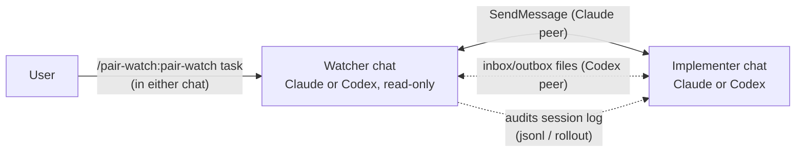

# pair-watch

🇯🇵 日本語: [README.ja.md](README.ja.md)

Two-seat pair programming for coding agents: an **implementer** plus a **read-only watcher** across
two independent chat sessions, with session-log auditing. Supports Claude + Claude,
Claude + Codex, and Codex + Codex. Started from one side with a single command.



## What it does

You open two chats and type `/pair-watch:pair-watch <one-line task>` in **only one** of them. The invoked
side — unless it was only told to stand by and wait — figures out its role, discovers the peer
session, delivers the peer a role brief, and the two
run a supervised loop: the implementer changes code; the watcher verifies reports against the real
artifacts, coordinates independent review gates, and never edits your source (it does write the
coordination files described below). Decisions that belong to
the human are pushed back to the human.

Two transports, selected automatically:

- **Claude peer** — push-driven messaging (SendMessage/ListAgents). No polling, token-cheap.
- **Codex CLI peer** — Codex cannot join cross-session messaging, so coordination switches to
  two sequenced files (the watcher writes `pair-inbox.md`, the implementer writes
  `pair-outbox.md`) plus rollout audit. A Codex implementer holds its turn while waiting for inbox;
  in Codex + Codex mode the Codex watcher likewise holds its turn while waiting for outbox. A
  completed-message sequence prevents lost wake-ups and partial reads. Design rationale:
  [design-inbox-watch](plugins/pair-watch/skills/pair-watch/references/design-inbox-watch.md).

A Codex watcher is supported only with a Codex implementer and must be requested explicitly. The
default remains the existing Claude peer flow.

## How it compares

Claude Code already ships several ways to run more than one agent, and Codex has its own. pair-watch does not replace them. It is one specific arrangement — two interactive seats with fixed roles and a verification protocol — built on top of Claude Code's cross-session messaging.

| | Runs as | Who steers | Cross-vendor | Independent verification |
|---|---|---|---|---|
| [Subagents](https://code.claude.com/docs/en/sub-agents) | Helpers inside one session; results return to the caller | Claude in that session | No | No — the caller summarises the result into its own context |
| [Agent teams](https://code.claude.com/docs/en/agent-teams) (experimental, env flag) | A lead session spawns teammates, each a full session | The lead; you can also message teammates | No | The lead approves plans; no audit of transcripts |
| [Cross-session messaging](https://code.claude.com/docs/en/cross-session-messaging) | Independent sessions you open yourself, exchanging text | You, per session | No | None built in — it is a channel |
| [Dynamic workflows](https://code.claude.com/docs/en/workflows) | A script orchestrating many subagents in the background | The script | No | Adversarial review can be scripted |
| [Codex subagents](https://developers.openai.com/codex/subagents) | Parallel workers inside one Codex session | Codex's orchestrator | No | No |
| Session managers (tmux, ccmanager, and similar) | Many sessions side by side | You | Visually, yes | None — no protocol between sessions |
| **pair-watch** | **Two interactive sessions you open, with fixed roles** | **You, from either chat; the watcher runs the loop** | **Claude + Claude, Claude + Codex, or Codex + Codex** | **Read-only watcher checks reports against git, tests, and the peer's own transcript; gated review before commits** |

### What is different by design

- **Fixed roles, starting from two seats.** One implementer, one read-only watcher. Two seats is the smallest arrangement in which one party can check the other without sharing its context. The same protocol extends to one watcher coordinating several user-opened implementer seats with disjoint scopes (see the skill's "Multiple implementer seats" section) — the watcher's review throughput and the user's confirmation backlog are the practical limits, so it does not fan out beyond a few seats.
- **The watcher verifies instead of summarising.** Reports are checked against read-only git, grep, and test logs, and against the peer's own session transcript when a claim matters — for example "the user approved this". Subagents and teammates report back into the same coordinator that steers them.
- **The human stays in the loop.** Both seats are ordinary chats you can talk to at any point, and anything that needs a decision goes back to you instead of being settled between the agents.
- **Cross-vendor or Codex-only.** Claude peers use cross-session messaging. Codex peers use the
  sequenced inbox/outbox transport. With Codex + Codex, both roles wait in opposite directions, so
  ordinary handoffs need no repeated "check the file" prompt.
- **Process included.** A task contract, a review gate before any commit (an independent reviewer must return `VERDICT: LGTM`), and commit conditions are part of the protocol. The reviewer is a fresh process of the other lineage where possible. If Claude is unavailable for a Codex implementer, a fresh read-only Codex context is the disclosed same-lineage fallback. Where the project's own `AGENTS.md` defines such rules, they take precedence.
- **Nothing resident to enable.** One command, no environment flag or daemon. Claude peers are
  push-driven; Codex peers use a bounded shell wait included with the skill.

### Before you use it

- **Cost.** Two full sessions, plus one reviewer process at each gate.
- **Most of the protocol is instructions.** Roles, stop conditions, writer ownership, and the
  `VERDICT` discipline depend on the models following the skill. The sequence-wait helper and static
  checks enforce only message completion and core document invariants.
- **A Codex seat needs room for long-running commands.** The file watch holds a shell sleep loop;
  where every command needs approval, that seat falls back to a manual nudge.

Use it for a non-trivial change where you want a second pair of eyes that verifies rather than summarises, or for a Codex implementer under supervision. The built-in process makes it overkill for quick edits, and the two-seat design is the wrong tool for parallel bulk work.

## What it reads and writes

Auditing is the point of the watcher role, so be aware of what it touches:

- The watcher may read the peer session's transcript on disk — Claude Code session files
  (`~/.claude/projects/<slug>/<id>.jsonl`) and Codex rollouts
  (`~/.codex/sessions/YYYY/MM/DD/rollout-*.jsonl`) — to verify start declarations, check claimed
  user approvals, and audit reports against what actually happened.
- During discovery, the invoked side (either role) may also read the recent user messages of up
  to two of this project's newest session logs to identify the peer before messaging anyone.
  Only the file path — never log content — is quoted to the candidate.
- The pair writes coordination files into your repository: the task contract (`_ai/tasks/<slug>/TASK.md`) and, with a Codex peer, `pair-inbox.md` / `pair-outbox.md` in that same `_ai/tasks/<slug>/` directory of the main checkout. Keep `_ai/` out of version control (add it to `.gitignore`).
- For work that changes code, a task branch and a separate git worktree are created — normally by the implementer, or by the watcher on its behalf when a Codex sandbox cannot write to `.git`. Nothing is done on the `main` checkout.
- Everything stays on your machine. Nothing is sent anywhere by this skill.

## Install

```text
/plugin marketplace add inakaegg/pair-watch
/plugin install pair-watch@pair-watch
```

Then, with two chats open in the same project, type in one of them:

```text
/pair-watch:pair-watch <one-line task>
```

The peer chat may start empty. You do not have to keep writing to both sides.

### Claude watcher + Codex implementer

1. Start Codex CLI in the same repository, in another terminal (Codex is installed separately).
2. In the Claude chat, type `/pair-watch:pair-watch <one-line task> — peer: Codex CLI`. Saying that the peer is Codex is what makes the Claude side the watcher; without it, Claude looks for a Claude peer and waits.
3. The first time only, the watcher asks you to paste one line into the Codex chat ("Read `<inbox path>` and follow it."). From then on the Codex implementer watches the inbox itself.

### Codex + Codex

1. Start two Codex CLI chats in the same repository.
2. In the chat that should be the read-only watcher, type
   `/pair-watch:pair-watch <one-line task> — peer: Codex CLI`.
3. The watcher asks you to paste one line into the implementer chat. Paste it once. The implementer
   watches inbox, and the watcher watches outbox between handoffs.

If either bounded watch reaches its approximately 30-minute limit, pair-watch names the role to
nudge: type "check the inbox" in the implementer chat or "check the outbox" in the watcher chat.

## Tested with

- Claude Code 2.1.224 or later (cross-session messaging: SendMessage / ListAgents / Monitor)
- Codex CLI 0.147.x when either seat is Codex (rollout layout `~/.codex/sessions/YYYY/MM/DD/`)

Log audit reads the session files both CLIs keep locally; see "What it reads and writes" for the paths.

## When it breaks

Typical symptoms and what they mean:

- *No peer found / no reply to the identification question within 15 minutes* — the other chat is
  not started, or ListAgents/SendMessage changed. The skill reports and waits for you.
- *The watcher is waiting for the first paste into the Codex chat* — on first start it asks you for one paste and waits up to 15 minutes; paste the line and it resumes.
- *A Codex peer never reacts to the inbox* — the file watch may have ended (30-minute cap) or the
  environment requires approval per command, where the watch cannot run. Type "check the inbox"
  into the Codex chat; the skill falls back to this manual nudge flow by design.
- *A Codex watcher never reacts to the outbox* — its bounded watch may have ended or required
  approval. Type "check the outbox" in the watcher chat.
- *Audit steps fail to find session files* — a CLI update moved them. File an issue; until then
  the setup still works, minus log audit.
- *Invoking `/pair-watch` keeps printing "Use the Skill tool to invoke…" and the skill never
  starts* — your installed copy is version 0.2.0, whose command stub shadowed the same-named
  skill (0.3.0 removed the stub, so the launch command is the full `/pair-watch:pair-watch`).
  Update the plugin: `claude plugin marketplace update <marketplace> && claude plugin
  update pair-watch@<marketplace>`, then start a new session.
- *A session-start note says the installed copy is behind the marketplace source* — the bundled
  version check found drift between the installed cache and the marketplace. Accept the suggested
  update commands, or ignore the note; the installed version keeps working as-is.

Stop conditions are listed in `SKILL.md`; the skill prefers stopping and asking over guessing.

## Origin and maintenance

This is the English edition of a skill from the author's private working kit
([agent-kit](https://github.com/inakaegg/agent-kit), Japanese). It is extracted here so it can be
installed standalone; the Japanese original continues to evolve inside the kit, and this edition
is maintained **best-effort**. If it stops working after a CLI update, an issue report with the
symptom is welcome.

## License

MIT — see [LICENSE](LICENSE).
