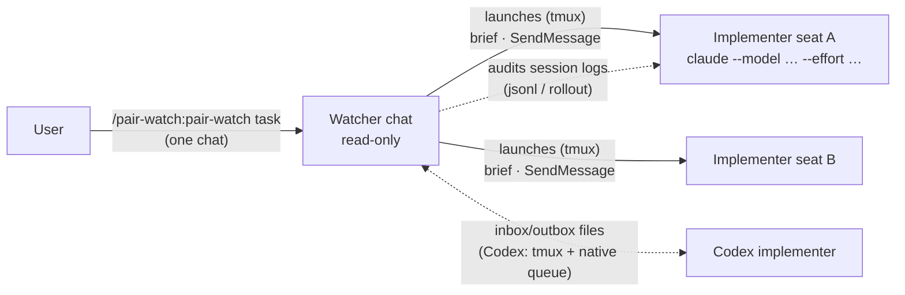
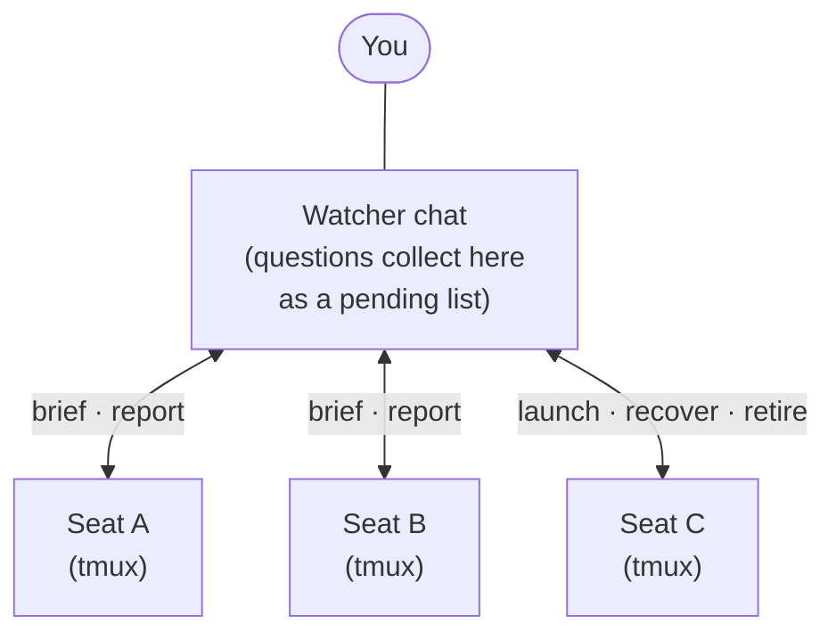

# pair-watch

🇯🇵 日本語: [README.ja.md](README.ja.md)

A plugin for Claude Code and Codex CLI that runs a coding task as a supervised pair from one chat. The chat you
type the command in becomes the **read-only watcher**; it launches one or more **implementer**
sessions itself, verifies their reports against git, tests, and their own session transcripts,
and runs an independent review before anything is committed. The watcher and each implementer
occupy a *seat* — an ordinary interactive session you can talk to. Works with Claude seats
(launched by the watcher) and Codex seats (Claude + Codex, or Codex + Codex), and scales from
one implementer to several under a single watcher.



## What it does

You open one chat and type `/pair-watch:pair-watch <one-line task>`. That chat is the watcher.
It writes or reads the task contract (goal, scope, acceptance criteria — a file at
`_ai/tasks/<slug>/TASK.md`), decides how many implementer seats the work needs (one,
unless the task splits into disjoint parts), launches each seat as a real CLI session under
tmux — with its own model and reasoning effort — and hands it a role brief. From there the pair
runs a supervised loop: the implementer changes code; the watcher checks reports against the
real artifacts instead of summarising them, coordinates an independent review before any
commit, and never edits your source (it does write the coordination files described below).
Decisions that belong to the human come back to you, in the watcher chat, as a pending list.
When a seat's task ends, the watcher retires it.

Two kinds of seat, selected by the invocation line:

- **Claude seat** (default from Claude) — launched by the watcher with `claude --model … --effort …
  --dangerously-skip-permissions` under tmux; push-driven messaging (SendMessage). No human
  watches its screen, so anything that needs a decision is sent to the watcher.
- **Codex seat** (default from Codex, or `— peer: Codex CLI`) — the watcher starts the
  interactive CLI under tmux. Instructions and reports use sequenced inbox/outbox files;
  `codex queue` wakes the next turn, including when the notification arrives mid-turn.
  The watcher checks the rollout against each report. `— seat: <thread UUID>` retains the
  user-opened file-watch route.

If you would rather use a chat you opened yourself, name it: `— seat: <name from the session
list>`. The watcher then briefs that session instead of launching one. It never searches for a
session on its own.

## Install

Claude Code:

```text
/plugin marketplace add inakaegg/pair-watch
/plugin install pair-watch@pair-watch
```

Codex CLI (the same repository also carries a Codex plugin manifest and marketplace):

```text
codex plugin marketplace add https://github.com/inakaegg/pair-watch
codex plugin add pair-watch@pair-watch
```

Start a new session afterwards; the skill is then available as `$pair-watch`. In a Codex chat
the plugin launches a Codex + Codex setup by default (below); a Codex chat cannot
message Claude seats.

### Before the first run (Claude seats)

For Codex seats, follow "Codex + Codex" below; these Claude messaging settings are not needed.

Launched Claude seats run with `--dangerously-skip-permissions`, and the watcher starts them through
tmux, so tmux has to be installed (verified on macOS). Three settings have to be in place, or
the launch fails silently; the watcher checks them and tells you which one is missing.

1. **Allow the tmux commands.** Add to `permissions.allow` — preferably in the project's
   `.claude/settings.json`, so the grant is scoped to that repository:

   ```json
   "Bash(tmux new-session:*)", "Bash(tmux send-keys:*)", "Bash(tmux capture-pane:*)",
   "Bash(tmux kill-session:*)", "Bash(tmux ls:*)"
   ```

   Know what you are granting: within their scope, these rules let any session start arbitrary
   commands via `tmux new-session`, inject keystrokes, and read pane contents without prompting
   — broader than pair-watch itself. Remove them when you stop using launched seats. The watcher
   cannot add them for you (self-editing permissions is blocked by design), and approving in the
   chat does not override the permission classifier.
2. **Accept messages from your other sessions.** Set `"crossSessionInbound": "accept"` in
   `~/.claude/settings.json` (or `/config` → "Messages from your other sessions"). Without it,
   a seat's replies are held for your approval and the setup goes silent.
3. **Run from a trusted project directory.** A seat launched in a directory you have not trusted
   stalls at the workspace-trust dialog. For work in a git worktree the watcher launches from the
   trusted main checkout and adds the worktree with `--add-dir`.

Then, in one chat:

```text
/pair-watch:pair-watch <one-line task>
```

Options: `— implementer: MODEL(EFFORT)` overrides a seat for this run; `— seat: NAME`
uses a user-opened Claude chat; `— peer: Codex CLI` selects a Codex implementer.

### Claude watcher + Codex implementer

In the Claude chat run `/pair-watch:pair-watch TASK — peer: Codex CLI`.
The watcher creates the worktree and channels, launches Codex under tmux, verifies its
identity and uses native queue notifications for later instructions.

### Codex + Codex

Start one Codex chat and run `$pair-watch TASK`. That chat is the read-only watcher and
launches the implementer seats. This route needs Python 3, tmux and a Codex CLI with
`codex queue` (verified with 0.153.4). It does not need Claude. Codex seats use
`-a never -s workspace-write`. Codex asks whether to trust a repository it has not seen
(a linked worktree counts as its main checkout); the launch helper answers that dialog for
you by default (it presses Enter on the preselected "Yes, continue"), and Codex records the
repository as trusted in its config (`~/.codex/config.toml` unless you set `CODEX_HOME`),
where it stays after the seat is retired.
Hook trust still follows normal approval.

To use a Codex chat you already opened, add `— seat: THREAD_UUID`. Only this legacy route
needs the first paste and bounded file watch; after its wait expires, nudge the relevant chat.

### Model settings and fallback

The model names, reasoning levels and ordered fallback lists are stored in
[`model-defaults.json`](plugins/pair-watch/skills/pair-watch/references/model-defaults.json).
Override them in the repository's tracked `pair-watch.settings.json`: `implementer` maps
each primary CLI (`codex` or `claude`) to a list; `reviewer` is a list. Each candidate is
`CLI:MODEL(EFFORT)`. A supplied role replaces that role's defaults. Project review settings
such as agent-kit take precedence for reviewers.

The resolver selects an installed CLI and reports the candidate and settings source.
Confirmed authentication, model availability or quota errors permit automatic fallback
in that list. Review findings and test failures do not. Every candidate is tried at most
once; no unlisted model or paid API is substituted. A provider change also requires its
communication route to be available: Claude seats need a watcher with SendMessage.

## Running several implementers

One watcher can supervise several seats at once, each with a scope that shares no branch,
worktree, or file with the others. The watcher partitions the work, launches one seat per part,
and retires each seat when its part is done — a seat is used for one task and never handed the
next one, because its context already holds the previous task and only you could compact it.

What changes for you is where your attention goes: the watcher chat only. Questions and reports
from every seat funnel into it; items that need your decision accumulate as a pending list
instead of interrupting you one by one. The watcher also handles the mechanics: a startup
handshake for each seat, stall detection and recovery when one goes quiet, and cleanup
afterwards.



There is no fixed ceiling on seats. Reviewers are separate processes and run in parallel, so
review throughput is not the limit. What bounds the number is the shape of the work: seats need
disjoint files and branches, so you can run only as many as you have independent tasks ready.
Two more limits grow with the count — the decisions that queue up for you, and the watcher's own
context. Operational detail lives in the skill's "Seats" section and in
[seat-launch](plugins/pair-watch/skills/pair-watch/references/seat-launch.md).

## Why another multi-agent mechanism?

Claude Code already ships several ways to run more than one agent, and Codex has its own.
Two questions separate them: **can you talk to the agent doing the work**, and **who checks
that work**.

Most existing mechanisms run workers you cannot talk to. Subagents — Claude's and Codex's
alike — and scripted workflows live inside the session that spawned them: you cannot interject
mid-task, and they end with it. (Their settings differ: a plain subagent inherits the parent's
reasoning effort and cannot raise it, while a scripted workflow — Dynamic workflows in the table
below — sets effort, and model, per agent.) What matters more is where their results go. A worker
reports to the orchestrator that steered it, and the orchestrator **summarises the report into
its own context and moves on** — it grades its own plan, and nobody re-checks the claims against
the artifacts. A script can build cross-checking into the run, but that checking still happens
inside the same orchestrator. For disposable research that is exactly right. For changes you
intend to commit, it is the weak link.

Plain cross-session messaging removes the first limitation — both sessions are ordinary chats —
but it is only a channel. Wire two sessions together and you reproduce the same
trust-the-report pattern by hand: one side asserts, the other believes. Nothing defines roles,
duties, or what must happen before a commit.

Agent teams come closest: teammates are full sessions, and you can message them directly. The
remaining difference is the direction of checking. The lead approves plans and consumes
reports; no role reads the teammates' transcripts back to verify what actually happened.

pair-watch takes the channel and adds the missing protocol:

- **Asymmetric roles.** The watcher never edits your source. Not writing the diff is what makes
  it a credible checker: it has no stake in the change, and its context is not shaped by having
  produced it.
- **A duty to verify.** The watcher checks reports against the artifacts first: read-only git,
  grep, rerunning the tests. The seat's transcript on disk is read for claims no artifact can
  prove — "the user approved this", "this decision came from the user" — which are confirmed in
  the log, not taken on faith. This auditing watcher is a different role from the review-gate
  reviewer, who is given a fresh context and never shown the implementer's conversation.
- **Seats you do not have to open.** One command in one chat; the watcher launches the seats,
  each with the model and effort the task deserves, and retires them afterwards.
- **One place for decisions.** Anything that needs a human lands in the watcher chat as a
  pending list, however many seats are running.
- **Seats beyond Claude.** Codex cannot join cross-session messaging, so a sequenced file
  transport carries the same roles and duties.

As a summary:

| | Runs as | Who steers | Cross-vendor | Independent verification |
|---|---|---|---|---|
| [Subagents](https://code.claude.com/docs/en/sub-agents) | Helpers inside one session; results return to the caller | Claude in that session | No | No — the caller summarises the result into its own context |
| [Agent teams](https://code.claude.com/docs/en/agent-teams) (experimental, env flag) | A lead session spawns teammates, each a full session | The lead; you can also message teammates | No | The lead approves plans; no audit of transcripts |
| [Cross-session messaging](https://code.claude.com/docs/en/cross-session-messaging) | Independent sessions you open yourself, exchanging text | You, per session | No | None built in — it is a channel |
| [Dynamic workflows](https://code.claude.com/docs/en/workflows) | A script orchestrating many subagents in the background | The script | No | Adversarial review can be scripted |
| [Codex subagents](https://developers.openai.com/codex/subagents) | Parallel workers inside one Codex session | Codex's orchestrator | No | No |
| Session managers (tmux, ccmanager, and similar) | Many sessions side by side | You | Visually, yes | None — no protocol between sessions |
| **pair-watch** | **Interactive sessions with fixed roles, launched by the watcher** | **You, from the watcher chat; the watcher runs the loop** | **Claude seats, Claude + Codex, or Codex + Codex** | **Read-only watcher checks reports against git, tests, and the seat's own transcript; independent review before commits** |

### What is different by design

- **Fixed, asymmetric roles.** One read-only watcher and one or more implementers — the smallest
  arrangement in which one party can check the other without sharing its context.
- **Minimum process defaults.** The skill inlines just enough process for the watcher to have a
  standard to verify against: a task contract, an independent review returning `VERDICT: LGTM`
  before any commit, and commit conditions. Where the project defines its own rules, those take
  precedence and pair-watch only runs the sessions. Both CLIs read the repository's `AGENTS.md`
  at startup, so any repository that states its contract and review rules there gets the same
  effect. The combination verified in practice is the author's
  [agent-kit](https://github.com/inakaegg/agent-kit), whose fuller contract and three-stage
  review slot in as that replacement.
- **Nothing resident to enable.** One command, no environment flag or daemon. Claude seats are
  push-driven; native Codex seats use queue notifications. User-opened Codex seats retain the bounded file wait.

### Before you use it

- **Cost.** Each seat is a full session, plus one reviewer process at each review.
- **Launched Claude seats skip permission prompts.** They run with `--dangerously-skip-permissions`;
  invoking pair-watch is your opt-in for that. The seat's questions go to the watcher, and the
  watcher's questions go to you.
- **Most of the protocol is instructions.** Roles, stop conditions, writer ownership, and the
  `VERDICT` discipline depend on the models following the skill. The sequence-wait helper and
  static checks enforce only message completion and core document invariants.
- **A user-opened Codex seat needs room for long-running commands.** The file watch holds a shell sleep
  loop; where every command needs approval, that seat falls back to a manual nudge.

Use it for a non-trivial change where you want a second pair of eyes that verifies rather than
summarises, for a Codex implementer under supervision, or for parallel work you want supervised
through one chat. The built-in coordination makes it overkill for quick edits.

## What it reads and writes

Auditing is the point of the watcher role, so be aware of what it touches:

- The watcher may read a seat's transcript on disk — Claude Code session files
  (`~/.claude/projects/<slug>/<id>.jsonl`) and Codex rollouts
  (`~/.codex/sessions/YYYY/MM/DD/rollout-*.jsonl`) — to verify start declarations, check claimed
  user approvals, and audit reports against what actually happened. It reads only the seats it
  launched or you named; it does not scan other sessions.
- The watcher writes coordination files inside the repository: the task contract
  (`_ai/tasks/<slug>/TASK.md`) and, with a Codex seat, `pair-inbox.md` / `pair-outbox.md` in the
  same `_ai/tasks/<slug>/` (main checkout). Keep `_ai/` out of version control (`.gitignore`).
- The watcher writes a small registry outside the repository: one file per seat at
  `~/.local/state/pair-watch/seats/<watcher-id>/<run-id>/`, recording the seat's label, project
  directory, tmux session, model, session id, and retirement time, so a watcher can tell its own
  seats from another run's. Native Codex records and channel claims remain as retired audit
  records; use new paths for a new run. Claude records are removed at the end of the run.
- For Claude seats, the watcher reads your Claude Code settings to check the three prerequisites above; it never
  edits them.
- For code changes, the work happens on a task branch in a separate git worktree. The watcher
  creates them before launching a seat, so it can point the seat at them; a `— seat:` session
  creates its own, and a user-opened Codex implementer creates its own unless its sandbox cannot write to
  `.git`, in which case the watcher does it. Work never happens on the `main` checkout.
- Everything stays on your machine. The skill sends nothing anywhere.

## Tested with

- Claude Code 2.1.224+ (cross-session messaging: SendMessage/ListAgents/Monitor; tmux-launched
  sessions verified on macOS)
- Codex CLI 0.153.4 for native launch, required when either seat is Codex (rollout layout
  `~/.codex/sessions/YYYY/MM/DD/`)

Log audit reads the session files both CLIs keep locally; see "What it reads and writes" for
the paths.

## When it breaks

Typical symptoms and what they mean:

- *A native Codex seat stops responding* — inspect its owned tmux pane and rollout. Preserve
  unreported work; do not automatically restart or adopt another process. A reopened Codex
  watcher checks the same registry and thread before notifying.

- *The watcher says a permission rule, `crossSessionInbound`, or a trusted directory is missing*
  — add what it names ("Before the first run" above) and tell it; it does not launch until then.
- *A launched seat never sends its start declaration* — the watcher looks at the seat's screen:
  a workspace-trust dialog (it clears it with `tmux send-keys`, or asks you to trust the
  directory), or replies held for approval (`crossSessionInbound`). If the screen shows nothing
  recoverable, it reports and waits.
- *A `— seat:` name is not listed* — that chat is not open, or the name differs. Give the exact
  name from the session list, or drop the option and let the watcher launch a seat.
- *A launched Claude seat sits on a question in its own window* — the brief tells seats never to ask on
  screen; if one does, the watcher dismisses the chooser with `tmux send-keys`, or kills the seat
  and resumes it with `claude --resume`. Nothing is lost either way.
- *The watcher is waiting for the first paste into a user-opened Codex chat* — on first start it asks you
  for one paste and waits up to 15 minutes; paste the line and it resumes.
- *A user-opened Codex seat never reacts to the inbox* — the file watch may have ended (30-minute cap) or the
  environment requires approval per command, where the watch cannot run. Type "check the inbox"
  into the Codex chat; the skill falls back to this manual nudge flow by design.
- *A Codex watcher on the manual route never reacts to the outbox* — its bounded watch may have ended or required
  approval. Type "check the outbox" in the watcher chat.
- *You closed a Claude watcher chat and reopened it, and its Claude seats fell silent* — the session and its
  history survive, but the messaging address is per process and changed. The reopened watcher
  rewrites its address record and re-derives each seat's address from its tmux session; the
  seats switch over on the next message. A seat that cannot reach any watcher writes its state
  into the task record and stops, without committing, merging, or messaging other sessions
  (`SKILL.md`, "Claude watcher restart and disappearance").
- *Audit steps fail to find session files* — a CLI update moved them. File an issue; until then
  the setup still works, minus log audit.
- *You are used to opening two chats and typing "wait for instructions" in one* — that flow was
  removed in 0.4.0. The watcher no longer searches for a peer; it launches seats, or briefs the
  chat you name with `— seat: <name>`.
- *Invoking `/pair-watch` keeps printing "Use the Skill tool to invoke…" and the skill never
  starts* — your installed copy is version 0.2.0, whose command stub shadowed the same-named
  skill (0.3.0 removed the stub, so the launch command is the full `/pair-watch:pair-watch`).
  Update the plugin: `claude plugin marketplace update <marketplace> && claude plugin
  update pair-watch@<marketplace>`, then start a new session.
- *A session-start note says the installed copy is behind the marketplace source* — the bundled
  version check found drift between the installed cache and the marketplace. Accept the suggested
  update commands, or ignore the note; the installed version keeps working as-is.

Stop conditions are listed in `SKILL.md`; the skill prefers stopping and asking over guessing.

## Origin and maintenance

This plugin began as a Japanese skill inside the author's working kit
([agent-kit](https://github.com/inakaegg/agent-kit)), with this plugin split out as its English
edition. For a while both existed; maintaining the same procedure in two places meant double
bookkeeping, so in August 2026 the workflow was consolidated into this plugin and the kit
retired its bundled copy. Until 0.3.x the user opened two chats and the invoked side searched
for its peer; live runs showed that the watcher launching the seats itself was both simpler and
more reliable, so 0.4.0 made that the default and removed the search. This plugin is the single
source for the workflow. If it stops working after a CLI update, an issue report with the
symptom is welcome. Using it together with agent-kit — or any repository whose `AGENTS.md`
defines contracts and reviews — is the intended arrangement: those rules replace the skill's
built-in process defaults, and pair-watch supplies the session operation.

## License

MIT
