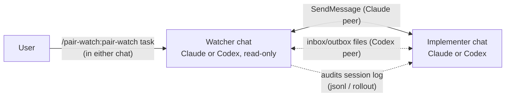
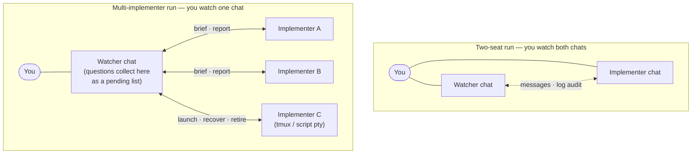

# pair-watch

🇯🇵 日本語: [README.ja.md](README.ja.md)

Run coding agents as a supervised pair: an **implementer** that changes code, and a **read-only
watcher** that verifies its reports against git, tests, and the implementer's own session
transcript. Both are ordinary interactive sessions you can talk to at any time. Works with
Claude + Claude, Claude + Codex, and Codex + Codex, and scales from one implementer to several
under a single watcher. Started from one side with a single command.



## What it does

You open two chats and type `/pair-watch:pair-watch <one-line task>` in **only one** of them.
The invoked side — unless it was only told to stand by — determines its role, discovers the peer
session, and delivers it a role brief. From there the pair runs a supervised loop: the
implementer changes code; the watcher checks reports against the real artifacts instead of
summarising them, coordinates an independent review before any commit, and never edits your
source (it does write the coordination files described below). Decisions that belong to the
human are pushed back to the human.

Two transports, selected automatically:

- **Claude peer** — push-driven messaging (SendMessage/ListAgents). No polling, token-cheap.
- **Codex CLI peer** — Codex cannot join cross-session messaging, so coordination switches to
  two sequenced files (the watcher writes `pair-inbox.md`, the implementer writes
  `pair-outbox.md`) plus rollout audit. A Codex implementer holds its turn while waiting for
  inbox; in Codex + Codex mode the Codex watcher likewise holds its turn while waiting for
  outbox. A completed-message sequence prevents lost wake-ups and partial reads. Design
  rationale: [design-inbox-watch](plugins/pair-watch/skills/pair-watch/references/design-inbox-watch.md).

A Codex watcher is supported only with a Codex implementer and must be requested explicitly.
The default remains the existing Claude peer flow.

## Install

```text
/plugin marketplace add inakaegg/pair-watch
/plugin install pair-watch@pair-watch
```

Then open two chats in the same project and, in one of them:

```text
/pair-watch:pair-watch <one-line task>
```

The peer chat can stay empty; you do not need to keep instructing both sides.

### Claude watcher + Codex implementer

1. Start Codex CLI in the same repository, in a separate terminal (Codex installed separately).
2. In the Claude chat: `/pair-watch:pair-watch <one-line task> — peer: Codex CLI`. Naming the
   peer as Codex makes the Claude side the watcher; without it, Claude looks for a Claude peer
   and waits.
3. On first start only, the watcher asks you to paste one line into the Codex chat ("Read
   `<inbox path>` and follow it."). After that, the Codex implementer watches the inbox itself.

### Codex + Codex

1. Start two Codex CLI chats in the same repository.
2. In the chat you want as the read-only watcher:
   `/pair-watch:pair-watch <one-line task> — peer: Codex CLI`.
3. The watcher hands you one line to paste into the implementer chat — once. After that the
   implementer waits on the inbox and the watcher waits on the outbox.

If a bounded wait (about 30 minutes) expires, pair-watch tells you which role to nudge: type
"check the inbox" to the implementer, "check the outbox" to the watcher.

## Running several implementers

One watcher can supervise several implementer sessions at once, each with a scope that shares no
branch, worktree, or file with the others. The sessions can be chats you open yourself, or —
with your approval, per run — sessions the watcher launches under tmux or `script(1)` and
retires when the work is done.

What changes for you is where your attention goes. You watch the watcher chat only. Questions
and reports from every implementer funnel into it; items that need your decision accumulate as a
pending list instead of interrupting you one by one. The watcher also handles the mechanics:
a startup handshake for each session, stall detection and recovery when one goes quiet, and
cleanup afterwards (retiring a session still requires your instruction — it may hold
uncommitted work).



The practical ceiling is three or four implementers. The bottleneck is not the sessions — it is
the review throughput the watcher can coordinate, and the decisions that queue up for you.
Operational detail lives in the skill's "Multiple implementer seats" section.

## Why another multi-agent mechanism?

Claude Code already ships several ways to run more than one agent, and Codex has its own.
Two questions separate them: **can you talk to the agent doing the work**, and **who checks
that work**.

Most existing mechanisms run workers you cannot talk to. Subagents — Claude's and Codex's
alike — and scripted workflows live inside the session that spawned them: you cannot interject
mid-task, they inherit the parent's model and reasoning settings, and they end with it. What
matters more is where their results go. A worker reports to the orchestrator that steered it,
and the orchestrator **summarises the report into its own context and moves on** — it grades
its own plan, and nobody re-checks the claims against the artifacts. For disposable research
that is exactly right. For changes you intend to commit, it is the weak link.

Plain cross-session messaging removes the first limitation — both sessions are ordinary chats —
but it is only a channel. Wire two sessions together and you reproduce the same
trust-the-report pattern by hand: one side asserts, the other believes. Nothing defines roles,
duties, or what must happen before a commit.

Agent teams come closest: teammates are full sessions, and you can message them directly. The
remaining difference is the direction of checking. The lead approves plans and consumes
reports; no role reads the teammates' transcripts back to verify what actually happened.

pair-watch takes the channel and adds the missing protocol:

- **Asymmetric roles.** The watcher never edits your source. Not writing the diff is what makes
  it a credible checker: it has no stake in the change, and its context is not shaped by having
  produced it.
- **A duty to verify.** The watcher checks reports against the artifacts first: read-only git,
  grep, rerunning the tests. The peer session's transcript on disk is read for claims no
  artifact can prove — "the user approved this", "this decision came from the user" — which are
  confirmed in the log, not taken on faith. This auditing watcher is a different role from the
  review-gate reviewer, who is given a fresh context and never shown the implementer's
  conversation.
- **Automated seating.** One command determines roles, finds the peer, and delivers the briefs.
- **One place for decisions.** Anything that needs a human lands in the watcher chat as a
  pending list, however many implementers are running.
- **Seats beyond Claude.** Codex cannot join cross-session messaging, so a sequenced file
  transport carries the same roles and duties.
- **Multi-implementer operation.** Scope partitioning, launching sessions with your approval,
  stall detection and recovery, cleanup — see "Running several implementers" above.

As a summary:

| | Runs as | Who steers | Cross-vendor | Independent verification |
|---|---|---|---|---|
| [Subagents](https://code.claude.com/docs/en/sub-agents) | Helpers inside one session; results return to the caller | Claude in that session | No | No — the caller summarises the result into its own context |
| [Agent teams](https://code.claude.com/docs/en/agent-teams) (experimental, env flag) | A lead session spawns teammates, each a full session | The lead; you can also message teammates | No | The lead approves plans; no audit of transcripts |
| [Cross-session messaging](https://code.claude.com/docs/en/cross-session-messaging) | Independent sessions you open yourself, exchanging text | You, per session | No | None built in — it is a channel |
| [Dynamic workflows](https://code.claude.com/docs/en/workflows) | A script orchestrating many subagents in the background | The script | No | Adversarial review can be scripted |
| [Codex subagents](https://developers.openai.com/codex/subagents) | Parallel workers inside one Codex session | Codex's orchestrator | No | No |
| Session managers (tmux, ccmanager, and similar) | Many sessions side by side | You | Visually, yes | None — no protocol between sessions |
| **pair-watch** | **Interactive sessions with fixed roles** | **You, from either chat; the watcher runs the loop** | **Claude + Claude, Claude + Codex, or Codex + Codex** | **Read-only watcher checks reports against git, tests, and the peer's own transcript; independent review before commits** |

### What is different by design

- **Fixed, asymmetric roles.** One implementer, one read-only watcher — the smallest arrangement
  in which one party can check the other without sharing its context. The same protocol extends
  to several implementers under one watcher ("Running several implementers" above).
- **Minimum process defaults.** The skill inlines just enough process for the
  watcher to have a standard to verify against: a task contract, an independent review returning
  `VERDICT: LGTM` before any commit, and commit conditions. Where the project defines its own
  rules, those take precedence and pair-watch only runs the sessions. This replacement is not an
  agent-kit-specific integration: both CLIs read the repository's `AGENTS.md` at startup, so any
  repository that states its contract and review rules there gets the same effect. The
  combination verified in practice is the author's
  [agent-kit](https://github.com/inakaegg/agent-kit), whose fuller contract and three-stage
  review slot in as that replacement.
- **Nothing resident to enable.** One command, no environment flag or daemon. Claude peers are
  push-driven; Codex peers use a bounded shell wait included with the skill.

### Before you use it

- **Cost.** Each running session is a full session, plus one reviewer process at each review.
- **Most of the protocol is instructions.** Roles, stop conditions, writer ownership, and the
  `VERDICT` discipline depend on the models following the skill. The sequence-wait helper and
  static checks enforce only message completion and core document invariants.
- **A Codex seat needs room for long-running commands.** The file watch holds a shell sleep
  loop; where every command needs approval, that seat falls back to a manual nudge.

Use it for a non-trivial change where you want a second pair of eyes that verifies rather than
summarises, for a Codex implementer under supervision, or for parallel work you want supervised
through one chat. The built-in coordination makes it overkill for quick edits.

## What it reads and writes

Auditing is the point of the watcher role, so be aware of what it touches:

- The watcher may read the peer session's transcript on disk — Claude Code session files
  (`~/.claude/projects/<slug>/<id>.jsonl`) and Codex rollouts
  (`~/.codex/sessions/YYYY/MM/DD/rollout-*.jsonl`) — to verify start declarations, check claimed
  user approvals, and audit reports against what actually happened.
- During discovery, the invoked side (either role) may read up to two fresh session logs in the
  same project to identify the peer from its latest user message, before messaging it. It quotes
  file paths, never log content, to candidates.
- One of the two sessions writes coordination files inside the repository: the task contract
  (`_ai/tasks/<slug>/TASK.md`) and, with a Codex peer, `pair-inbox.md` / `pair-outbox.md` in the
  same `_ai/tasks/<slug>/` (main checkout). Keep `_ai/` out of version control (`.gitignore`).
- For code changes, the pair creates a task branch and a separate git worktree — normally the
  implementer; the watcher does it instead when the Codex sandbox cannot write to `.git`. Work
  never happens on the `main` checkout.
- Everything stays on your machine. The skill sends nothing anywhere.

## Tested with

- Claude Code 2.1.224+ (cross-session messaging: SendMessage/ListAgents/Monitor)
- Codex CLI 0.147-line, required when either seat is Codex (rollout layout
  `~/.codex/sessions/YYYY/MM/DD/`)

Log audit reads the session files both CLIs keep locally; see "What it reads and writes" for
the paths.

## When it breaks

Typical symptoms and what they mean:

- *No peer found / no reply to the identification question within 15 minutes* — the other chat is
  not started, or ListAgents/SendMessage changed. The skill reports and waits for you.
- *A sent message or reply never reaches the other chat* — it is held on the receiving side,
  waiting for that user's approval. Claude Code gates inbound cross-session messages by default,
  even when the receiver runs with `--dangerously-skip-permissions`, and a one-off approval does
  not carry over to the next message. Set `"crossSessionInbound": "accept"` in
  `~/.claude/settings.json` on both sides (or `/config` → "Messages from your other sessions").
- *The watcher is waiting for the first paste into the Codex chat* — on first start it asks you
  for one paste and waits up to 15 minutes; paste the line and it resumes.
- *A Codex peer never reacts to the inbox* — the file watch may have ended (30-minute cap) or the
  environment requires approval per command, where the watch cannot run. Type "check the inbox"
  into the Codex chat; the skill falls back to this manual nudge flow by design.
- *A Codex watcher never reacts to the outbox* — its bounded watch may have ended or required
  approval. Type "check the outbox" in the watcher chat.
- *Audit steps fail to find session files* — a CLI update moved them. File an issue; until then
  the setup still works, minus log audit.
- *Invoking `/pair-watch` keeps printing "Use the Skill tool to invoke…" and the skill never
  starts* — your installed copy is version 0.2.0, whose command stub shadowed the same-named
  skill (0.3.0 removed the stub, so the launch command is the full `/pair-watch:pair-watch`).
  Update the plugin: `claude plugin marketplace update <marketplace> && claude plugin
  update pair-watch@<marketplace>`, then start a new session.
- *A session-start note says the installed copy is behind the marketplace source* — the bundled
  version check found drift between the installed cache and the marketplace. Accept the suggested
  update commands, or ignore the note; the installed version keeps working as-is.

Stop conditions are listed in `SKILL.md`; the skill prefers stopping and asking over guessing.

## Origin and maintenance

This plugin began as a Japanese skill inside the author's working kit
([agent-kit](https://github.com/inakaegg/agent-kit)), with this plugin split out as its English
edition. For a while both existed; maintaining the same procedure in two places meant double
bookkeeping, so in August 2026 the workflow was consolidated into this plugin and the kit
retired its bundled copy. This plugin is now the single source for the workflow. If it stops working after a
CLI update, an issue report with the symptom is welcome. Using it together with agent-kit — or
any repository whose `AGENTS.md` defines contracts and reviews — is the intended arrangement:
those rules replace the skill's built-in process defaults, and pair-watch supplies the session
operation.

## License

MIT
