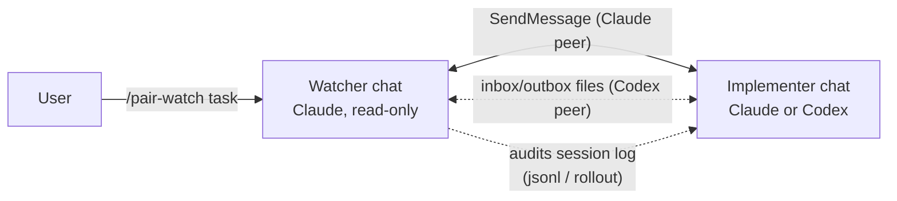

# pair-watch

🇯🇵 日本語: [README.ja.md](README.ja.md)

Cross-vendor pair programming for coding agents: an **implementer** plus a **read-only watcher**
across two chat sessions, with session-log auditing. Started from one side with a single command.



## What it does

You open two chats and type `/pair-watch <one-line task>` in **only one** of them. The invoked
side figures out its role, discovers the peer session, delivers the peer a role brief, and the two
run a supervised loop: the implementer changes code; the watcher verifies reports against the real
artifacts, coordinates independent review gates, and never edits code. Decisions that belong to
the human are pushed back to the human.

Two transports, selected automatically:

- **Claude peer** — push-driven messaging (SendMessage/ListAgents). No polling, token-cheap.
- **Codex CLI peer** — Codex cannot join cross-session messaging, so coordination switches to
  agreed files (`pair-inbox.md` / `pair-outbox.md`) plus rollout audit. While waiting for the
  watcher, the Codex implementer holds its turn and watches the inbox with a sleep loop
  (**inbox-watch**), so it starts moving the moment an instruction lands. Design rationale:
  [design-inbox-watch](plugins/pair-watch/skills/pair-watch/references/design-inbox-watch.md).

Codex is implementer-only; the watcher is always a Claude chat. Why the reverse is deliberately
unsupported is covered in the design note.

## Privacy: this skill reads the peer session's logs

Auditing is the point of the watcher role, so be aware of what it touches:

- The watcher may read the peer session's transcript on disk — Claude Code session files
  (`~/.claude/projects/<slug>/<id>.jsonl`) and Codex rollouts
  (`~/.codex/sessions/YYYY/MM/DD/rollout-*.jsonl`) — to verify start declarations, check claimed
  user approvals, and audit reports against what actually happened.
- Everything stays on your machine. Nothing is sent anywhere by this skill.

## Install

```text
/plugin marketplace add inakaegg/pair-watch
/plugin install pair-watch@pair-watch
```

Then, with two chats open in the same project, type in one of them:

```text
/pair-watch <one-line task>
```

The peer chat may start empty. You do not have to keep writing to both sides.

## Tested with

- Claude Code 2.1.x (requires SendMessage / ListAgents / Monitor)
- Codex CLI 0.147.x (rollout layout `~/.codex/sessions/YYYY/MM/DD/`)

These are **not stable interfaces**. Session-file locations, message tools, and rollout layout can
change with any release of either CLI.

## When it breaks

Typical symptoms and what they mean:

- *No peer found / no reply to the identification question within 15 minutes* — the other chat is
  not started, or ListAgents/SendMessage changed. The skill reports and waits for you.
- *A Codex peer never reacts to the inbox* — the inbox-watch may have ended (30-minute cap) or the
  environment requires approval per command, where the watch cannot run. Type "check the inbox"
  into the Codex chat; the skill falls back to this manual nudge flow by design.
- *Audit steps fail to find session files* — a CLI update moved them. File an issue; until then
  the setup still works, minus log audit.

Stop conditions are listed in `SKILL.md`; the skill prefers stopping and asking over guessing.

## Origin and maintenance

This is the English edition of a skill from the author's private working kit
([agent-kit](https://github.com/inakaegg/agent-kit), Japanese). It is extracted here so it can be
installed standalone; the Japanese original continues to evolve inside the kit, and this edition
is maintained **best-effort**. If it stops working after a CLI update, an issue report with the
symptom is welcome.

## License

MIT — see [LICENSE](LICENSE).
