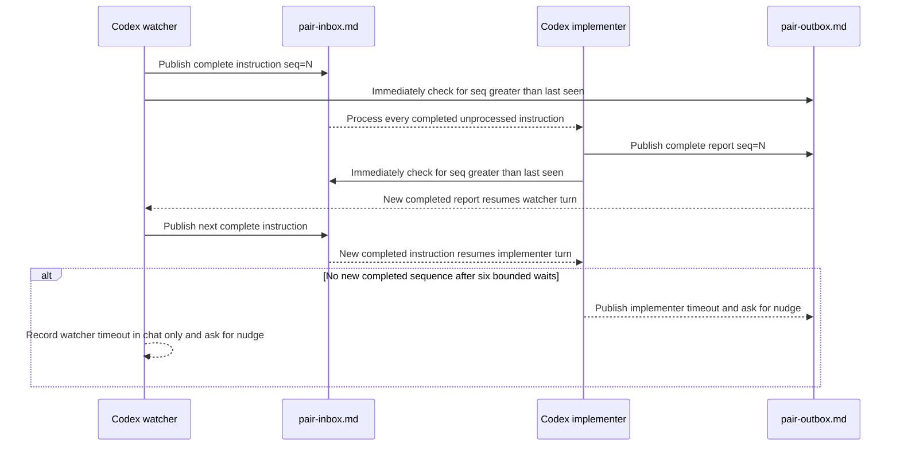

# Design note — sequenced file watch for Codex peers

Summary:

- Transport C is pair-watch's communication mode for a Codex peer: the watcher writes
  `pair-inbox.md`, the implementer writes `pair-outbox.md`, and the watcher audits the implementer
  rollout when a claim needs verification.
- Claude watcher + Codex implementer remains supported. Codex + Codex mode adds a Codex watcher and
  keeps both Codex turns open: the implementer waits for inbox, while the watcher waits for outbox.
- Every new message ends with a strictly increasing `PAIR_MSG_END seq=<N>` marker. The reader waits
  for a sequence greater than the last one it processed, so a reply that arrives before the wait
  starts is not lost and a partially written message is not consumed.
- Each approximately five-minute wait can be re-armed six times. After about 30 minutes, the user
  is told exactly which role needs a manual nudge.
- Codex + Codex mode uses two independent top-level chats. It is not one parent Codex delegating to
  subagents, because the pair-watch value is two separately auditable and human-steerable seats.

The runtime rules live in `transport-codex.md`. This note records why those rules exist and which
alternatives were rejected.

## History

1. **Transcript polling** — The first pair periodically read the peer transcript (Claude jsonl or
   Codex rollout). It reacted automatically but repeatedly paid to inspect growing transcripts.
2. **Claude cross-session messaging** — SendMessage/ListAgents made Claude + Claude receive-driven.
   Continuous transcript reading was no longer needed.
3. **Transport C** — Codex could not join that messaging channel, so a Claude watcher and Codex
   implementer exchanged an inbox and outbox. The user initially had to type “check the inbox” at
   each handoff.
4. **Implementer inbox-watch** — The Codex implementer kept its current turn open with a bounded
   shell wait. The user nudge became a timeout fallback instead of the normal path.
5. **Sequenced, symmetric file watch** — The watcher can now also be Codex. Both roles hold their
   turn while waiting on the file written by the peer, and completed-message sequences close the
   lost-wakeup and partial-write gaps of modification-time polling.

## The problem to solve

Codex is turn-driven: after a turn ends, a file change alone does not start another turn. A useful
Codex + Codex pair therefore cannot let either role end its turn while it expects a peer response.
It also cannot take a checksum or modification time only after sending, because the peer may answer
before that baseline is captured. In that ordering, the answer becomes the baseline and the role
waits for a change that already happened.

## The design

Each check happens before the first sleep. If no completed sequence is ready, the same command
continues with bounded polling; the arrows above show the handoff that resumes the waiting turn.

### One writer per file

Only the watcher edits inbox; only the implementer edits outbox. This prevents simultaneous writes
to the same file and keeps authorship auditable. Inbox keeps the newest instruction first. Outbox is
append-only. Both remain in the main checkout under the ignored task directory.

### A completed-message sequence, not a file timestamp

Each writer increments its own file sequence and publishes one whole message ending with
`PAIR_MSG_END seq=<N>`. The peer remembers the largest sequence it has processed. The watch script
checks for a larger completed sequence immediately and after each sleep.

This ordering handles three cases:

- **Reply before watch starts** — the immediate check sees a sequence greater than `last_seen`.
- **Reply while waiting** — a later poll sees the new completion marker.
- **Write still in progress** — content without the completion marker is not a message yet.

Messages alternate, with at most one unacknowledged message in either direction. That invariant
avoids a burst whose earlier instruction could be skipped. The only extra message allowed without a
peer acknowledgement is an implementer timeout report, because its purpose is to say the response
never arrived.

### The same wait in opposite directions

After an implementer report, the implementer waits for a newer inbox sequence. After a Codex
watcher instruction, the watcher waits for a newer outbox sequence. A shell wait keeps the current
turn alive; when it exits 0, the same agent turn reads and processes the completed peer message.

This is the fact that changes the earlier decision that a Codex watcher was inherently unsuitable.
The earlier design assumed the watcher would end its turn and need an external wake-up for every
irregular report. In Codex + Codex mode the watcher does not end: it holds the turn on the outbox in
the same bounded way the implementer already holds the turn on the inbox.

### Bounded failure and a role-specific nudge

One wait runs for about five minutes and can be re-armed up to six times. If the implementer gives
up, it appends `WATCH_ENDED role=implementer` to outbox and tells the user to nudge that chat. If the
watcher gives up, it writes `WATCH_ENDED role=watcher` only in its own chat and asks the user to type
“check the outbox” there. It does not edit inbox merely to record its timeout, because that would
falsely wake an implementer.

## Rollout identification with two Codex chats

Both rollouts may contain the same inbox path. The watcher therefore pins its own rollout before it
creates the channel. The implementer start declaration supplies its rollout path and thread id. A
fallback search excludes the already pinned watcher rollout and must leave exactly one result;
modification time is not used to guess.

## Alternatives not taken

### Modification time

Second-resolution modification times can miss two writes in one second. They also say only that a
file changed, not that a complete message exists.

### Checksum captured when the wait starts

A checksum detects same-second changes, but it still loses a response that arrives between sending
and baseline capture. Persisting the last processed message sequence makes the baseline semantic
and available before the response.

### Continuous transcript polling

Full transcript polling repeats large reads and mixes communication with audit. Transport files
carry ordinary handoffs; rollout reads remain occasional verification steps.

### Cron or a resident daemon

An external process could periodically start new inference, but it adds installation, lifecycle,
and cost management. The bounded file wait needs no resident service and automatically falls back
to a manual nudge when the environment cannot hold a command.

### One Codex session with subagents

Subagents are useful for delegated parallel work, but their results return to a coordinator. They
do not provide two independently opened chats with fixed roles, separate user steering, and mutual
session-log audit. A fresh subagent may serve as a gate reviewer fallback, not as one of the seats.

## Cost model

The blocking shell command itself produces no model output while sleeping. Model work resumes when
the command returns, including the small step needed to re-arm a timed-out five-minute wait. The
six-run cap bounds that overhead. Codex + Codex still consumes two full agent sessions plus a fresh
reviewer at required gates.

## Constraints accepted knowingly

- After the roughly 30-minute cap, one manual nudge is required for the role named in its chat.
- Environments that require approval for every wait command fall back to manual nudges. The skill
  never bypasses approval.
- Same-lineage implementation and review can share blind spots. Claude remains the first reviewer
  choice for a Codex implementer; a fresh read-only Codex reviewer is the disclosed fallback while
  Claude is unavailable.
- Codex watcher + Claude implementer remains unsupported because the Claude peer already has the
  receive-driven SendMessage path and the combination does not enable Codex + Codex operation.
